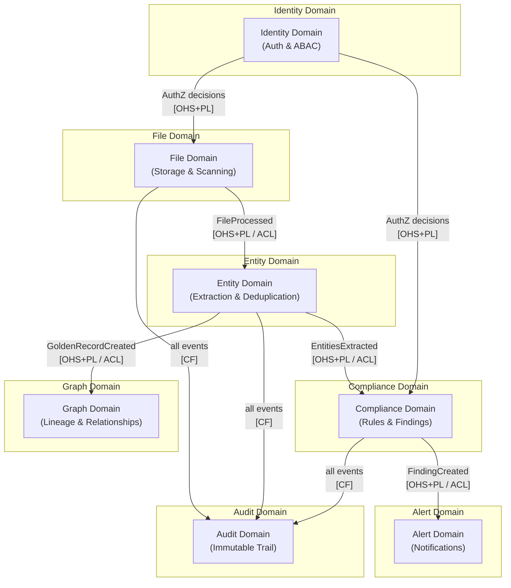

# Skill: design/bounded-context-map

## Purpose
Produce the Bounded Context Map — the architectural overview showing all bounded contexts, their relationships, and how they communicate. This document drives the multi-repo decomposition: one repository per bounded context (default). It is the output of Event Storming's boundary-drawing phase made formal and implementable.

## Inputs
- `artifacts/design/domain/events.md`
- `artifacts/design/domain/commands.md`
- `artifacts/design/domain/policies.md`
- `artifacts/design/domain/context.md`
- Event Storming session output

## Output
**File:** `artifacts/design/bounded-contexts.md`
**Registers in manifest:** yes

## Bounded Context Rules (enforced)
- Each bounded context has its own ubiquitous language — the same word may mean different things in different contexts. This is correct and expected.
- Each bounded context owns its own data. No shared databases between contexts.
- Relationships between contexts are typed using the DDD relationship patterns below.
- Anti-Corruption Layers (ACL) are required at every boundary where the upstream model would contaminate the downstream model if used directly.
- The mapping must identify which context is Upstream (U) and which is Downstream (D) for every relationship.

## Relationship Types (from DDD)
- **Shared Kernel (SK)**: Two teams share a common model subset. Use sparingly — creates coupling.
- **Customer-Supplier (C-S)**: Upstream team accommodates downstream team's needs.
- **Conformist (CF)**: Downstream conforms entirely to upstream model with no translation.
- **Anti-Corruption Layer (ACL)**: Downstream translates upstream model to protect its own model.
- **Open Host Service (OHS)**: Upstream publishes a well-defined protocol usable by all.
- **Published Language (PL)**: A common language published for all consumers (usually combined with OHS).
- **Separate Ways (SW)**: Contexts have no integration — they go their own way.

## Artifact Template

```markdown
# Bounded Context Map

**Product:** {product_name}
**Phase:** Design
**Artifact:** Bounded Context Map
**Version:** 1.0
**Date:** {date}
**Status:** Draft

---

## Context Map Diagram



---

## Bounded Context Register

| Context | Subdomain classification | Primary aggregate(s) | Owns |
|---------|------------------------|---------------------|------|
| **File Domain** | Core | StorageLocation, FileProcessingJob | Storage location registry, scan state, file metadata |
| **Entity Domain** | Core | ExtractedEntity, GoldenRecord | Entity extraction results, deduplication, master records |
| **Compliance Domain** | Core | ComplianceRule, Finding, Exception | Rule definitions, evaluation results, finding lifecycle |
| **Graph Domain** | Core | DataLineageNode, DataLineageEdge | Lineage graph, relationship traversal |
| **Identity Domain** | Supporting | User, Role, Permission, Tenant | Authentication, authorisation, tenant management |
| **Alert Domain** | Supporting | AlertChannel, AlertPolicy, Alert | Notification delivery, channel management |
| **Audit Domain** | Supporting | AuditEntry | Immutable audit trail |
| **Billing Domain** | Generic (3rd party) | — | Subscription, usage metering — Stripe or equivalent |

---

## Relationship Details

### File Domain → Entity Domain
| Attribute | Value |
|-----------|-------|
| **Direction** | File Domain (U) → Entity Domain (D) |
| **Pattern** | Open Host Service + Published Language / Anti-Corruption Layer |
| **Integration mechanism** | Redpanda topic `file-domain.events` |
| **Events flowing** | `FileDiscovered`, `FileProcessed`, `FileModified`, `FileDeleted` |
| **ACL rationale** | Entity Domain must not couple to File Domain's `StorageLocation` or `FileProcessingJob` types. Entity Domain uses its own `SourceReference` concept. |
| **Translation** | `file_path` → `source_reference.path`, `storage_location_id` → `source_reference.origin_id` |

---

### Entity Domain → Compliance Domain
| Attribute | Value |
|-----------|-------|
| **Direction** | Entity Domain (U) → Compliance Domain (D) |
| **Pattern** | Open Host Service + Published Language / Anti-Corruption Layer |
| **Integration mechanism** | Redpanda topic `entity-domain.events` |
| **Events flowing** | `GoldenRecordCreated`, `GoldenRecordUpdated`, `EntityFlaggedForReview` |
| **ACL rationale** | Compliance Domain uses `DataSubject` not `GoldenRecord` — these are different conceptual models for the same real-world thing. ACL translates between them. |

---

### Entity Domain → Graph Domain
| Attribute | Value |
|-----------|-------|
| **Direction** | Entity Domain (U) → Graph Domain (D) |
| **Pattern** | Open Host Service + Published Language / Anti-Corruption Layer |
| **Integration mechanism** | Redpanda topic `entity-domain.events` |
| **Events flowing** | `GoldenRecordCreated`, `GoldenRecordUpdated`, `RelationshipIdentified` |
| **ACL rationale** | Graph Domain models nodes and edges — the Golden Record becomes a node. Translation needed. |

---

### All Domains → Audit Domain
| Attribute | Value |
|-----------|-------|
| **Direction** | All domains (U) → Audit Domain (D) |
| **Pattern** | Conformist |
| **Rationale** | Audit Domain intentionally conforms to the upstream events — it records them verbatim. No translation needed. |
| **Integration mechanism** | Each domain publishes to its own Redpanda topic; Audit consumer subscribes to all |

---

### Identity Domain → Other Domains
| Attribute | Value |
|-----------|-------|
| **Direction** | Identity Domain (U) → consuming domains (D) |
| **Pattern** | Open Host Service + Published Language |
| **Integration mechanism** | Synchronous (JWT validation at API Gateway); async not required |
| **Note** | Identity Domain is not event-driven from the perspective of consuming domains — they call it for auth decisions via mTLS-secured gRPC / HTTP |

---

## Repository Mapping (from Bounded Contexts)

| Bounded Context | Repository | Language | Primary DB |
|----------------|------------|----------|------------|
| File Domain | `{github_org}/{product}-file-domain` | Go | PostgreSQL |
| Entity Domain | `{github_org}/{product}-entity-domain` | Go | PostgreSQL + Apache AGE |
| Compliance Domain | `{github_org}/{product}-compliance-domain` | Go | PostgreSQL |
| Graph Domain | `{github_org}/{product}-graph-domain` | Go | Apache AGE (PostgreSQL ext.) |
| Identity Domain | `{github_org}/{product}-identity-domain` | Go | PostgreSQL |
| Alert Domain | `{github_org}/{product}-alert-domain` | Go | PostgreSQL |
| Audit Domain | `{github_org}/{product}-audit-domain` | Go | PostgreSQL (append-only, immutable) |
| Platform (infra shared) | `{github_org}/{product}-platform` | OpenTofu + Helm | — |

---

## Shared Kernel (if any)
{List any shared kernel elements — types shared across bounded contexts without translation. Prefer none; note if introduced.}

> **Default:** No shared kernel. Cross-context types are translated at ACL boundaries. Shared schema is a coupling risk and is avoided.

---

## Open Questions / Hotspots
{Any unresolved boundary questions flagged during Event Storming that need decision before implementation.}

| Hotspot | Description | Decision needed by |
|---------|-------------|-------------------|
| {e.g. Who owns the "file type classification" rule?} | {File Domain extracts MIME type; Compliance Domain uses it as a signal. Is type classification a File Domain concern or a Compliance Domain concern?} | {Before Implement phase} |
```

## Quality Checks
- [ ] Every bounded context relationship is typed with a DDD relationship pattern
- [ ] Every upstream/downstream direction is explicit
- [ ] ACL is required and documented for every relationship where model contamination risk exists
- [ ] Every bounded context maps to exactly one repository
- [ ] No shared database exists between bounded contexts (each owns its own schema)
- [ ] Shared kernel, if present, is minimal and justified
