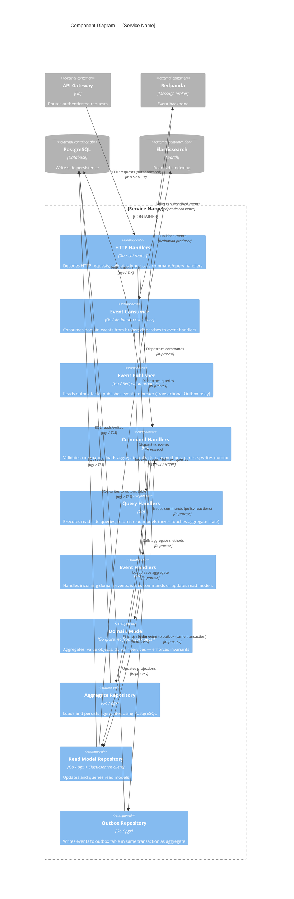

# Skill: design/component-diagram

## Purpose
Produce a C4 Component Diagram (Level 3) for one service container. Opens a service to show its internal components: API handlers, command handlers, event publishers, event consumers, domain model, repositories, and adapters. This diagram guides the developer implementing the service.

## Inputs
- `artifacts/design/architecture/c4-container.md`
- `artifacts/design/domain/aggregates/` (for the target bounded context)
- `artifacts/design/domain/commands.md` (filtered to target context)
- `artifacts/design/domain/events.md` (filtered to target context)
- `artifacts/design/domain/read-models/` (filtered to target context)
- **Argument required:** service/container name (e.g. `file-domain-service`, `compliance-domain-service`)

## Output
**File:** `artifacts/design/architecture/c4-component-{service-name}.md`
**Registers in manifest:** yes

## C4 Level 3 Rules (enforced)
- Components are the major structural building blocks inside one container (not classes — groups of classes with a clear responsibility).
- Show only what is inside the target container; other containers are referenced as external boxes.
- Each component has a name, technology hint, and one-line responsibility.
- Hexagonal architecture layers must be visible: API (port) → Application (command/query handlers) → Domain (model) → Infrastructure (repositories, adapters).

## Artifact Template

```markdown
# C4 Component Diagram: {Service Name}

**Product:** {product_name}
**Bounded Context:** {context name}
**Container:** {service name}
**Phase:** Design
**Artifact:** Component Diagram (C4 Level 3)
**Version:** 1.0
**Date:** {date}
**Status:** Draft

---

## Diagram



---

## Component Descriptions

### HTTP Handlers
- **Layer:** API (Driving port)
- **Responsibility:** Receive HTTP requests from the API Gateway, decode and validate the request body/params, map to commands or queries, forward to the appropriate handler, serialize the response.
- **Does NOT:** Contain business logic. Does not call the domain model directly.
- **Go package:** `internal/api/handlers/`

### Command Handlers
- **Layer:** Application
- **Responsibility:** Validate command preconditions, load the target aggregate from the repository, call the domain method, persist the aggregate, write the resulting domain event(s) to the outbox — all in a single transaction.
- **Key rule:** Every command handler is a unit of work — load, mutate, persist, outbox in one database transaction.
- **Go package:** `internal/application/commands/`

### Query Handlers
- **Layer:** Application (read side)
- **Responsibility:** Execute read-only queries against read model repositories. Never load aggregates. Never modify state.
- **Go package:** `internal/application/queries/`

### Event Consumer
- **Layer:** Infrastructure (Driven port)
- **Responsibility:** Maintain a Redpanda consumer group membership; receive events from the broker; decode the event envelope; dispatch to the appropriate Event Handler.
- **Key rule:** Consumer must be idempotent — the same event may be delivered more than once (at-least-once). Check idempotency key before processing.
- **Go package:** `internal/infrastructure/messaging/consumer/`

### Event Publisher (Outbox Relay)
- **Layer:** Infrastructure
- **Responsibility:** Poll the outbox table for unpublished events; publish each to the Redpanda topic; mark as published in the outbox.
- **Key rule:** Runs as a background goroutine or sidecar. Guarantees at-least-once delivery. Downstream consumers must be idempotent.
- **Go package:** `internal/infrastructure/messaging/publisher/`

### Event Handlers
- **Layer:** Application
- **Responsibility:** React to incoming domain events — either issue a command (policy) or update a read model (projection). This is where cross-context policies are implemented (after ACL translation).
- **Go package:** `internal/application/eventhandlers/`

### Domain Model
- **Layer:** Domain
- **Responsibility:** Aggregates, value objects, domain services, domain events. Contains ALL business logic. Has zero dependencies on frameworks, databases, or message brokers.
- **Key rule:** Domain model methods return domain events (or errors). They do not persist or publish.
- **Go package:** `internal/domain/`

### Aggregate Repository
- **Layer:** Infrastructure (Driven port)
- **Responsibility:** Load an aggregate by ID from PostgreSQL; persist aggregate state changes. Implements repository interface defined in the domain layer.
- **Go package:** `internal/infrastructure/persistence/`

### Read Model Repository
- **Layer:** Infrastructure
- **Responsibility:** Update read model projections (write path) and serve read model queries (read path). May use PostgreSQL, Elasticsearch, or both depending on the read model.
- **Go package:** `internal/infrastructure/readmodels/`

### Outbox Repository
- **Layer:** Infrastructure
- **Responsibility:** Write domain events to the `{service}_outbox` table in the same database transaction as the aggregate save. This guarantees events are not lost if the process crashes before publishing to Redpanda.
- **Go package:** `internal/infrastructure/persistence/outbox/`

---

## Package Structure

```
{service-name}/
├── cmd/
│   └── server/          # main.go — wiring, DI, server startup
├── internal/
│   ├── api/
│   │   └── handlers/    # HTTP Handlers
│   ├── application/
│   │   ├── commands/    # Command Handlers
│   │   ├── queries/     # Query Handlers
│   │   └── eventhandlers/ # Event Handlers
│   ├── domain/          # Domain Model (pure Go, no dependencies)
│   │   ├── aggregates/
│   │   ├── valueobjects/
│   │   ├── events/
│   │   └── services/
│   └── infrastructure/
│       ├── persistence/ # Aggregate + Outbox repositories (pgx)
│       ├── readmodels/  # Read model repositories
│       └── messaging/
│           ├── consumer/
│           └── publisher/
└── migrations/          # SQL migration files (numbered, timestamped)
```
```

## Quality Checks
- [ ] Hexagonal layers are clearly visible: API → Application → Domain → Infrastructure
- [ ] Domain model package has no dependencies on infrastructure packages
- [ ] Command handlers use the Transactional Outbox pattern (aggregate save + outbox write in one transaction)
- [ ] Event consumer is explicitly idempotent
- [ ] Read-side (query handlers + read model repos) never touches aggregate state
- [ ] Package structure follows the defined convention
