# Skill: design/container-diagram

## Purpose
Produce the C4 Container Diagram (Level 2) — opens the system box to show the major deployable units (containers): services, databases, message brokers, frontends. Shows how containers interact and what technology each uses. This is the architecture diagram most useful to technical leads and senior engineers.

## Inputs
- `artifacts/design/bounded-contexts.md`
- `artifacts/design/architecture/c4-context.md`
- `sdlc-config.json`
- `artifacts/design/domain/events.md` (for message flow)

## Output
**File:** `artifacts/design/architecture/c4-container.md`
**Registers in manifest:** yes

## C4 Level 2 Rules (enforced)
- A "container" in C4 is any separately deployable unit: a service, a database, a message broker, a frontend, a job.
- Show the technology stack for each container.
- Show the communication protocol between containers.
- External systems from the Context diagram reappear here in grey — they are referenced but not expanded.
- One bounded context = one or more containers (typically: one API service + shared DB within the BC).
- The diagram should answer: "what would I deploy and in what order?"

## Artifact Template

```markdown
# C4 Container Diagram

**Product:** {product_name}
**Phase:** Design
**Artifact:** Container Diagram (C4 Level 2)
**Version:** 1.0
**Date:** {date}
**Status:** Draft

---

## Diagram

```mermaid
C4Container
  title Container Diagram for {product_name}

  Person(admin, "Administrator", "")
  Person(user, "Compliance Officer / Auditor", "")

  System_Boundary(product, "{product_name}") {
    Container(web_ui, "Web UI", "React / TypeScript", "Browser-based dashboard for configuration, findings review, and reporting")
    Container(api_gateway, "API Gateway", "Go / net/http + chi", "Unified API entry point; handles auth, rate limiting, routing")

    Container(file_svc, "File Domain Service", "Go", "Manages storage location registry, scan orchestration, file metadata")
    Container(entity_svc, "Entity Domain Service", "Go", "Extracts PII/sensitive entities from processed files; manages golden records")
    Container(compliance_svc, "Compliance Domain Service", "Go", "Evaluates compliance rules against entity graph; manages findings lifecycle")
    Container(graph_svc, "Graph Domain Service", "Go", "Maintains data lineage graph; answers relationship queries")
    Container(identity_svc, "Identity Domain Service", "Go", "Authentication, ABAC authorisation, tenant management")
    Container(alert_svc, "Alert Domain Service", "Go", "Manages alert channels, policies, and notification delivery")
    Container(audit_svc, "Audit Domain Service", "Go", "Consumes all domain events; writes immutable, append-only audit trail")

    Container(worker_node, "Worker Node", "Go", "Deployed in customer infrastructure; traverses storage, extracts text")

    ContainerDb(pg_file, "File DB", "PostgreSQL", "Storage locations, file metadata, scan state")
    ContainerDb(pg_entity, "Entity DB", "PostgreSQL + Apache AGE", "Golden records, entity graph")
    ContainerDb(pg_compliance, "Compliance DB", "PostgreSQL", "Rules, findings, exceptions")
    ContainerDb(pg_identity, "Identity DB", "PostgreSQL", "Users, tenants, roles, permissions")
    ContainerDb(pg_audit, "Audit DB", "PostgreSQL (append-only)", "Immutable audit entries")
    ContainerDb(es, "Search & Analytics", "Elasticsearch", "Full-text search, log aggregation, dashboard analytics")

    Container(broker, "Message Broker", "Redpanda", "Event streaming backbone; domain event routing")
  }

  System_Ext(storage, "Customer Storage Systems", "Google Drive / S3 / SharePoint")
  System_Ext(secrets, "Secrets Manager", "AWS SM / HashiCorp Vault")
  System_Ext(idp, "Identity Provider", "OIDC / OAuth2")

  Rel(admin, web_ui, "Uses", "HTTPS")
  Rel(user, web_ui, "Uses", "HTTPS")
  Rel(web_ui, api_gateway, "API calls", "HTTPS / REST")
  Rel(api_gateway, identity_svc, "Validates JWT, checks permissions", "mTLS / gRPC")
  Rel(api_gateway, file_svc, "Routes file domain requests", "mTLS / HTTP")
  Rel(api_gateway, compliance_svc, "Routes compliance requests", "mTLS / HTTP")
  Rel(api_gateway, graph_svc, "Routes graph queries", "mTLS / HTTP")

  Rel(file_svc, pg_file, "Reads/writes", "pgx / TLS")
  Rel(file_svc, broker, "Publishes domain events", "Redpanda producer")
  Rel(entity_svc, pg_entity, "Reads/writes", "pgx / TLS")
  Rel(entity_svc, broker, "Consumes FileProcessed; publishes EntitiesExtracted", "Redpanda consumer/producer")
  Rel(compliance_svc, pg_compliance, "Reads/writes", "pgx / TLS")
  Rel(compliance_svc, broker, "Consumes EntitiesExtracted; publishes FindingCreated", "Redpanda consumer/producer")
  Rel(audit_svc, pg_audit, "Writes (append-only)", "pgx / TLS")
  Rel(audit_svc, broker, "Consumes all domain events", "Redpanda consumer")

  Rel(worker_node, storage, "Traverses and reads files", "Platform API (read-only)")
  Rel(worker_node, secrets, "Reads credentials at scan time", "SDK (read-only)")
  Rel(worker_node, file_svc, "Reports scan results", "mTLS / HTTP")
  Rel(identity_svc, idp, "Delegates authentication", "OIDC")
  Rel(file_svc, es, "Indexes file metadata", "Elasticsearch API")
  Rel(compliance_svc, es, "Indexes findings", "Elasticsearch API")
```



---

## Container Inventory

| Container | Technology | Deployed in | Purpose |
|-----------|-----------|-------------|---------|
| Web UI | React / TypeScript | Product infrastructure (per tenant) | Browser-based UI |
| API Gateway | Go / net/http + chi | Product infrastructure | Auth, routing, rate limiting |
| File Domain Service | Go | Product infrastructure | Scan orchestration, file registry |
| Entity Domain Service | Go | Product infrastructure | Entity extraction coordination |
| Compliance Domain Service | Go | Product infrastructure | Rule evaluation, finding lifecycle |
| Graph Domain Service | Go | Product infrastructure | Lineage graph management |
| Identity Domain Service | Go | Product infrastructure | AuthN / ABAC AuthZ |
| Alert Domain Service | Go | Product infrastructure | Notification delivery |
| Audit Domain Service | Go | Product infrastructure | Immutable audit trail |
| Worker Node | Go | **Customer infrastructure** | File traversal and text extraction |
| Message Broker | Redpanda | Product infrastructure | Event backbone |
| Elasticsearch | Elasticsearch | Product infrastructure | Search, analytics, logs |

---

## Communication Patterns

| From | To | Protocol | Pattern |
|------|----|----------|---------|
| Services → Redpanda | Redpanda | Redpanda producer | Transactional Outbox |
| Redpanda → Services | Services | Redpanda consumer | At-least-once with idempotent handlers |
| API Gateway → Services | Services | mTLS HTTP | Synchronous request/response |
| Services → Databases | PostgreSQL | pgx over TLS | Direct (no ORM) |
| Worker Node → File Service | File Service | mTLS HTTP | Synchronous result reporting |

---

## Physical Deployment Notes

- **Physical multi-tenancy:** Each tenant gets dedicated Kubernetes namespace (or separate cluster for isolation tier). No shared compute between tenants.
- **Worker Node deployment:** Deployed by customer into their own Kubernetes cluster / VM. Communicates outbound to product control plane only — no inbound connections from product to customer network.
- **Linkerd service mesh:** Automatic mTLS on all pod-to-pod communication within the product infrastructure.
```

## Quality Checks
- [ ] Every bounded context from `artifacts/design/bounded-contexts.md` has at least one container
- [ ] Every container shows its technology stack
- [ ] Worker Node is explicitly shown as customer-infrastructure-deployed
- [ ] Communication protocols are labelled on all relationships
- [ ] No file content flows from customer infrastructure to product infrastructure
- [ ] Redpanda is the event backbone — no direct database-to-database relationships between bounded contexts
