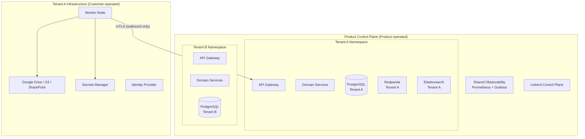

# Skill: design/deployment-architecture

## Purpose
Produce the Deployment Architecture document — how the product is deployed, what Kubernetes topology is used, how tenants are isolated at the infrastructure level, and how the deployment pipeline flows from code to production.

## Inputs
- `sdlc-config.json` (tenancy_model, deployment_target, cloud_providers)
- `artifacts/design/architecture/c4-container.md`
- `artifacts/design/bounded-contexts.md`

## Output
**File:** `artifacts/design/platform/deployment-architecture.md`
**Registers in manifest:** yes

## Artifact Template

```markdown
# Deployment Architecture

**Product:** {product_name}
**Phase:** Design
**Artifact:** Deployment Architecture
**Version:** 1.0
**Date:** {date}
**Tenancy model:** {from sdlc-config: physical-multi-tenant}
**Deployment target:** {from sdlc-config}
**Status:** Draft

---

## Deployment Topology Overview



---

## Kubernetes Topology

### Physical Multi-Tenancy (default)

Each tenant is isolated at the **Kubernetes namespace level** (minimum) or **separate cluster level** (enterprise tier):

| Isolation tier | Topology | Use case |
|---------------|---------|---------|
| Standard | Dedicated namespace per tenant, shared cluster | Default; cost-efficient for initial scale |
| Enterprise | Dedicated cluster per tenant | Highest isolation; regulatory requirement |

**Namespace naming:** `{product-codename}-tenant-{tenant-id}`

**Cross-namespace traffic:** Denied by default via NetworkPolicy. Linkerd policies enforce allow-list.

### Local Development
- **Tool:** `kind` (Kubernetes in Docker)
- **Config:** `platform/kind-config.yaml`
- Single-node cluster; all services deployed to `default` namespace

### Hosted Tenants (self-managed, smaller)
- **Tool:** `k3s`
- **Config:** Helm chart + OpenTofu for node provisioning

### Cloud-Managed (customer cloud or product cloud)
- **EKS / GKE / AKS** — provider selected per `cloud_providers` in sdlc-config.json
- Managed node groups; auto-scaling via KEDA (event-driven)

---

## Service Deployment Model

All domain services are deployed as Kubernetes Deployments with:
- **Replicas:** minimum 2 (production); 1 (dev)
- **Pod Disruption Budget:** `minAvailable: 1` — rolling updates never take all pods down
- **Health checks:** liveness probe (process health), readiness probe (can serve traffic), startup probe (slow-start containers)
- **Resource limits:** defined per service in Helm values; no unlimited resource requests
- **Linkerd sidecar:** injected automatically via namespace annotation

---

## GitOps Deployment Pipeline

```
Developer PR → GitHub Actions CI → Build + Test + Scan
                                  → Push image to registry (GHCR)
                                  → Update Helm values in infra repo (image tag)
                                  → ArgoCD detects change → sync to cluster
```

**CI gate (must pass before image push):**
- Unit tests
- Integration tests
- Contract tests (event schema validation)
- SAST (Semgrep)
- Secrets scan (gitleaks)
- Dependency vulnerability scan (govulncheck + trivy)
- Docker image scan (trivy)

**Deployment strategy:** Blue-Green (default); Canary available via Argo Rollouts for high-traffic services.

---

## Infrastructure as Code

| Tool | Scope | Location |
|------|-------|---------|
| OpenTofu | Cloud infrastructure (VPC, K8s cluster, PostgreSQL, Redpanda, ES) | `{product}-platform` repo, `infra/` |
| Helm | Application deployment (services, configs, secrets refs) | `{product}-platform` repo, `helm/` |
| ArgoCD | GitOps sync from git to cluster | Installed in cluster; config in `platform` repo |
| Sealed Secrets | Secret encryption in git | Controller in cluster |
| External Secrets Operator | Secret sync from Vault/AWS SM to K8s | Controller in cluster |

---

## Worker Node Deployment

Worker Nodes are deployed **into the customer's infrastructure** — not the product's:

1. Customer provisions a VM or K8s pod in their environment
2. Product generates a Worker Node configuration package (mTLS cert + config)
3. Customer deploys the Worker Node using the provided Helm chart or Docker image
4. Worker Node registers with product control plane via mTLS
5. Worker Node pulls scan configuration; executes locally; reports results back

**Worker Node does NOT:**
- Send file content to the product control plane
- Require inbound network access from the product
- Store extracted text beyond the current scan operation

---

## Observability Stack Deployment

| Component | Deployment | Scope |
|-----------|-----------|-------|
| Prometheus | Per cluster | Scrapes all service metrics |
| Grafana | Per cluster | Dashboards; connected to Prometheus + Elasticsearch + Tempo |
| Fluent Bit | DaemonSet (per node) | Collects container logs → Elasticsearch |
| Tempo | Per cluster | Distributed tracing receiver (OpenTelemetry) |
| OpenTelemetry Collector | Per cluster | Receives traces/metrics from services; routes to backends |
```

## Quality Checks
- [ ] Tenant isolation at Kubernetes level is specified
- [ ] Worker Node deployment model is explicitly in customer infrastructure (not product)
- [ ] GitOps pipeline is documented with CI gates
- [ ] IaC tools are named with their scope
- [ ] Deployment strategy (Blue-Green / Canary) is specified
- [ ] Resource limits and health checks are mentioned for all deployments
