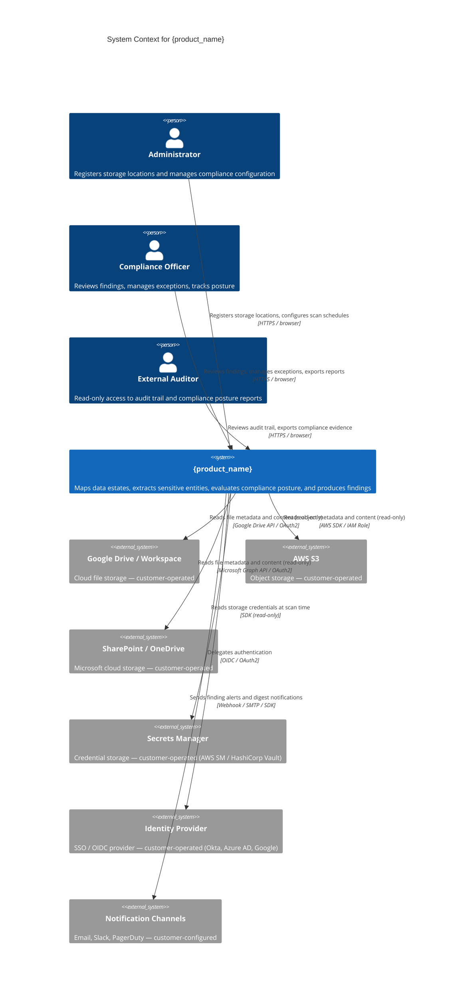

# Skill: design/system-context-diagram

## Purpose
Produce the C4 System Context Diagram (Level 1) — the highest-level view of the system. Shows the product as a black box in the centre, surrounded by the people (personas) who use it and the external systems it integrates with. This diagram is for communicating to non-technical stakeholders and executive sponsors.

## Inputs
- `artifacts/strategy/vision.md`
- `artifacts/ideate/personas/` (all persona files)
- `artifacts/ideate/requirements/functional.md`
- `sdlc-config.json`

## Output
**File:** `artifacts/design/architecture/c4-context.md`
**Registers in manifest:** yes

## C4 Level 1 Rules (enforced)
- The system under development appears once in the centre.
- People (users, roles) are shown as external actors.
- External systems (third-party services, storage platforms, customer-controlled systems) are shown as external boxes.
- No internal components visible at this level — it is a black box.
- Every relationship has a label describing what flows (not how).
- Relationships include direction (arrow) and protocol/mechanism where relevant.

## Artifact Template

```markdown
# C4 System Context Diagram

**Product:** {product_name}
**Phase:** Design
**Artifact:** System Context (C4 Level 1)
**Version:** 1.0
**Date:** {date}
**Status:** Draft

---

## Diagram



---

## System Description

**System:** {product_name}

{2–3 sentence description of the system from the outside — what it does, not how it does it. Who uses it, what value it delivers.}

---

## External Actors

| Actor | Type | Relationship to system |
|-------|------|----------------------|
| Administrator | Person (internal to customer org) | Configures the system; registers storage locations |
| Compliance Officer | Person (internal to customer org) | Primary beneficiary; consumes compliance findings |
| External Auditor | Person (third party) | Read-only evidence consumer |

---

## External Systems

| System | Operated by | Purpose | Integration |
|--------|------------|---------|-------------|
| Google Drive / Workspace | Customer | File storage being scanned | Google Drive API (read-only) |
| AWS S3 | Customer | Object storage being scanned | AWS SDK (read-only IAM role) |
| SharePoint / OneDrive | Customer | Microsoft file storage being scanned | Microsoft Graph API (read-only) |
| Secrets Manager | Customer | Credential storage | SDK (read-only, at scan time) |
| Identity Provider | Customer | SSO / authentication | OIDC / OAuth2 |
| Notification Channels | Customer-configured | Alert delivery | Webhook / SMTP |

---

## What the System Does NOT Do (Context Boundary)

| Out of scope | Reason |
|-------------|--------|
| Store file content | Files are scanned in customer infrastructure; no content transits or is stored on product infrastructure |
| Manage customer user accounts | Delegated to customer's identity provider |
| Write to any customer storage system | Read-only access is an architectural non-negotiable |
| Process data outside customer-controlled infrastructure | WorkerNodes execute in customer environment |
```

## Quality Checks
- [ ] System appears once as a black box — no internal components visible
- [ ] All external personas from `artifacts/ideate/personas/` are represented
- [ ] All external system integrations from functional requirements are included
- [ ] "What the system does NOT do" is populated — clarifies the boundary
- [ ] No implementation details in the diagram (no technology names in boxes, only in relationship labels where relevant)
