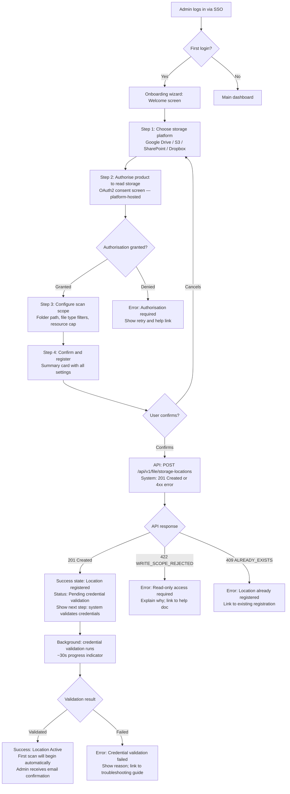

# Skill: design/ux-flow

## Purpose
Produce UX Flow diagrams — user journey maps through the product for each key persona, showing screen flows, decision points, and system feedback. This bridges the requirements and architecture to what the user actually experiences. UX flows inform the API contract and the UI component hierarchy.

## Inputs
- `artifacts/ideate/personas/` (all persona files)
- `artifacts/ideate/backlog/stories/` (all user stories)
- `artifacts/ideate/story-map.md`
- **Argument required:** persona slug or flow name (e.g. `admin-onboarding`, `compliance-officer-finding-review`)

## Output
**File:** `artifacts/design/ux/flows/{flow-name}.md`
**Registers in manifest:** yes

## UX Flow Rules (enforced)
- Every flow starts from the persona's job-to-be-done, not from a menu or screen name.
- Every decision point shows what happens on both happy path AND error/empty/loading states.
- System feedback is explicit: what does the user see while the system is processing?
- Flows identify API calls — each screen transition that requires data shows which endpoint is called.
- Accessibility notes are included (keyboard navigation, screen reader hints) for key screens.

## Artifact Template

```markdown
# UX Flow: {Flow Name}

**Product:** {product_name}
**Phase:** Design
**Artifact:** UX Flow
**Persona:** {persona name and role}
**Job:** {the JTBD this flow fulfils}
**Version:** 1.0
**Date:** {date}
**Status:** Draft

---

## Flow: Admin Onboarding — Register First Storage Location

**Persona:** Administrator
**Job:** "I need to connect our Google Drive to the product so it can start scanning for compliance risks"
**Entry point:** First login after tenant provisioning

---

### Flow Diagram



---

### Screen Descriptions

#### Step 1: Choose Storage Platform
- **Purpose:** Select which platform to connect
- **UI:** Card grid with platform logos and names; primary action "Connect"
- **Empty state:** N/A — always shows all supported platforms
- **Accessibility:** Keyboard navigable; platform cards are focusable with Enter to select

#### Step 2: OAuth2 Authorisation
- **Purpose:** Platform consent flow (hosted by the storage platform — Google, Microsoft, etc.)
- **Product responsibility:** Open the OAuth2 consent URL in a new window/tab; listen for callback
- **Success:** Callback received with auth code; product exchanges for token (server-side)
- **Error:** User closes window without consenting; token exchange fails — show friendly error with retry

#### Step 3: Configure Scan Scope
- **Fields:** Folder path (text input with browse button), file type include/exclude (tag input), resource cap % (slider 5–50%)
- **Defaults:** Root folder, all file types, 20% resource cap
- **Validation:** Real-time (before submit); path format validated against selected platform's conventions

#### Step 4: Confirm and Register
- **Summary card:** Platform name, folder path (first 60 chars), file type config, resource cap, credential reference (masked)
- **Warning (if applicable):** "This is a broad scan scope — consider narrowing to a specific folder for the initial run"
- **Primary action:** "Register Location" button
- **Secondary action:** "Edit Settings" link

---

### API Calls in This Flow

| Step | API call | Loading state | Error handling |
|------|----------|-------------|---------------|
| Step 4 confirm | `POST /api/v1/file/storage-locations` | Button spinner; form disabled | Show inline error message from API `detail` field |
| Credential validation | Polling `GET /api/v1/file/storage-locations/{id}` every 5s | Progress bar with status label | Show error state with action link |

---

### Empty and Error States

| State | User sees | User can do |
|-------|----------|------------|
| No storage locations yet | Illustration + "Connect your first storage location" CTA | Click CTA → this flow |
| Credential validation timeout (>2 min) | Warning banner: "Validation is taking longer than expected" | Wait or contact support |
| Network error during registration | Toast: "Couldn't save — please try again" | Retry; check status page |
```

## Quality Checks
- [ ] Flow starts from the JTBD (not a menu item)
- [ ] Both happy path and error states are shown in the diagram
- [ ] API calls are identified per screen transition
- [ ] Loading and empty states are documented
- [ ] Accessibility notes are included
- [ ] Error messages reference specific API error codes
