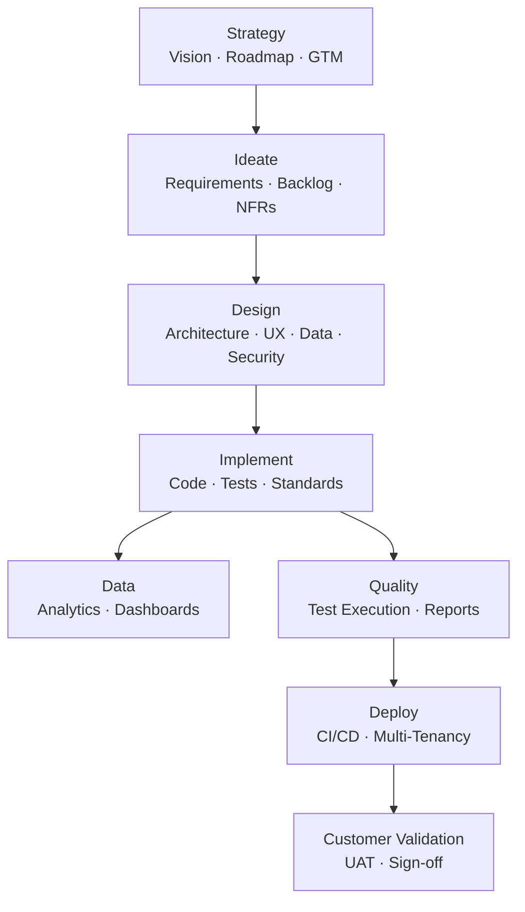
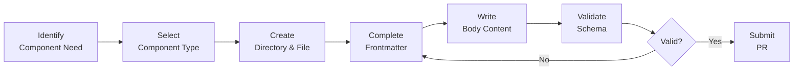
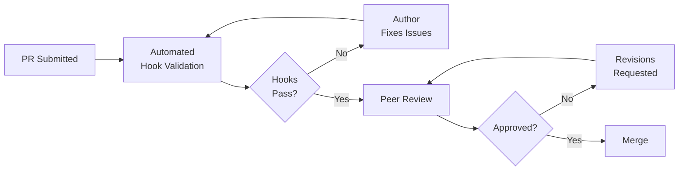
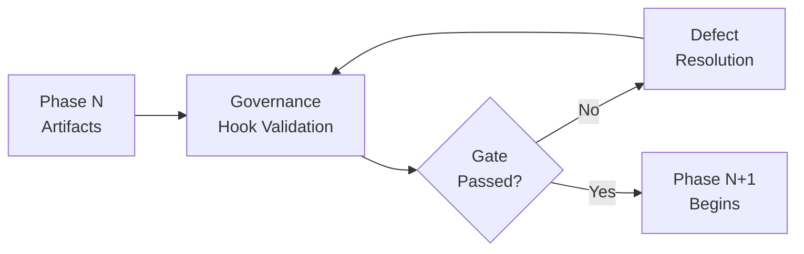
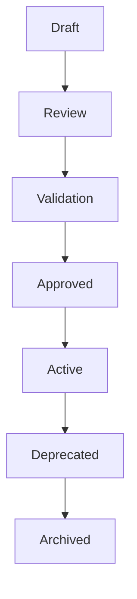

# SDLC Artifact Factory

> A Claude Code plugin that drives any product through its full software development lifecycle — from strategy to customer validation — producing real, reviewable, standards-compliant artifacts at every phase.

**Author:** Shafi Babar | **Version:** 06.24.2026 | **Status:** Active Development

---

## Table of Contents

- [Executive Summary](#executive-summary)
- [Repository Metadata](#repository-metadata)
- [Why This Repository Exists](#why-this-repository-exists)
- [Repository Vision](#repository-vision)
- [Core Objectives](#core-objectives)
- [Repository Structure](#repository-structure)
- [SDLC Artifact Framework](#sdlc-artifact-framework)
- [Artifact Standards](#artifact-standards)
- [Documentation Standards](#documentation-standards)
- [Repository Governance](#repository-governance)
- [AI-Assisted Development Standards](#ai-assisted-development-standards)
  - [Component Architecture](#component-architecture)
  - [Skills](#skills)
  - [Agents](#agents)
  - [Commands](#commands)
  - [Hooks](#hooks)
  - [MCP Servers](#mcp-servers)
  - [LSP Integrations](#lsp-integrations)
  - [Tools](#tools)
  - [Component Selection Guide](#component-selection-guide)
- [Architectural Principles](#architectural-principles)
- [Contributor Guide](#contributor-guide)
- [Repository Workflows](#repository-workflows)
- [Standards Reference](#standards-reference)
- [Future Repository Evolution](#future-repository-evolution)
- [Frequently Asked Questions](#frequently-asked-questions)
- [Glossary](#glossary)
- [References](#references)

---

## Executive Summary

### Vision

Build a reusable, distributable Claude Code plugin that acts as a complete virtual engineering team — capable of taking any problem statement and producing enterprise-grade, methodology-compliant artifacts across every phase of the software development lifecycle.

### Purpose

The SDLC Artifact Factory eliminates the gap between product intent and engineering execution. It operationalizes industry-proven methodologies (DDD, Event Storming, TDD, BDD, SOLID) as enforced standards rather than suggestions, ensuring every product built through this plugin is built the same disciplined way.

### Problem Statement

Building software products at a professional quality bar requires deep, simultaneous expertise across product management, architecture, engineering, testing, security, data, and platform operations. Most teams lack complete coverage. This plugin bridges that gap through AI-assisted development that is governed, traceable, and methodology-compliant by design.

### Intended Audience

| Audience | How This Repository Serves Them |
|---|---|
| Product Managers | Drives the full lifecycle from vision to UAT |
| Architects | Enforces DDD, CQRS, event-driven, and distributed system patterns |
| Platform Engineers | Provides deployment, CI/CD, and multi-tenancy scaffolding |
| AI Engineers | Defines the agent roster, skills, hooks, and MCP integrations |
| Contributors | Documents standards, conventions, and governance expectations |
| Enterprise Users | Produces auditable, compliance-ready artifact trails |

### Expected Outcomes

- Every product built through this plugin produces the same complete artifact set
- Methodology compliance is enforced, not advisory
- Artifacts are reviewable, versioned, and traceable
- The plugin itself is built using the same standards it enforces

---

## Repository Metadata

| Attribute | Value |
|---|---|
| **Repository Purpose** | Claude Code plugin for full-lifecycle, artifact-producing SDLC automation |
| **Status** | Active Development |
| **Maturity** | Greenfield — foundational design complete, implementation in progress |
| **Documentation Standard** | Markdown, GitHub-compatible, frontmatter-governed |
| **Governance Model** | Methodology-first; DDD, Event Storming, TDD, BDD, and SOLID are non-negotiable |
| **Target Users** | Product Managers, Architects, Engineers, AI Engineers, Enterprise Teams |
| **Primary Deliverables** | Skills, Agents, Commands, Hooks, MCP Servers, LSP Integrations, Tools |
| **Methodology Enforcement** | Blocking — absence of applicable methodology in an artifact is a defect |
| **Budget Posture** | Frugal — process over tooling, iterative delivery |

---

## Why This Repository Exists

### The Business Problem

Shipping quality software products consistently requires simultaneous expertise that no single person or small team possesses. Product strategy, architecture, UX, backend engineering, testing, security, data, and platform operations must all be performed — and coordinated — correctly.

### The Engineering Problem

Even when expertise exists, consistency fails at scale. Patterns drift. Standards erode. Methodology is applied unevenly. Artifacts from the strategy phase don't connect cleanly to design, which doesn't connect cleanly to implementation. Reviews find gaps only after significant cost has been incurred.

### The Documentation Problem

Documentation is written after the fact, if at all. Artifacts are not traceable to decisions. There is no shared ubiquitous language enforced across teams. Context is held in people's heads, not in reviewable artifacts.

### The AI-Assisted Development Problem

AI coding assistants are powerful but undirected. Without a governing structure — a defined agent roster, skill library, hook system, and methodology backbone — AI assistance produces inconsistent outputs, reinvents patterns per session, and cannot be audited or reproduced.

### The Solution

The SDLC Artifact Factory provides a governing structure for AI-assisted product development. It defines what to build, how to build it, which methodology applies where, and what every artifact must contain. The result is a replicable, auditable, methodology-compliant product development pipeline.

---

## Repository Vision

### Long-Term Vision

A reusable, distributable plugin that any team can install into Claude Code and immediately gain access to a complete virtual engineering capability — from problem statement to deployed, tested, customer-validated product.

### Guiding Principles

- **The plugin builds other products.** Every product built through this plugin must be built the same disciplined way. The plugin itself must also be built that way.
- **Methodology is non-negotiable.** DDD, Event Storming, TDD, BDD, and SOLID are not optional. Their absence in any applicable artifact is a defect.
- **Process over tooling.** Prefer disciplined, frugal, iterative delivery over expensive or complex toolchain choices.
- **Ubiquitous language must not drift.** Terminology defined in the canonical glossary must remain identical across every agent, skill, hook, command, MCP, and LSP.
- **Thin vertical slices over broad coverage.** Earn breadth iteratively. A working end-to-end slice is more valuable than broad, shallow coverage.
- **Every component has one responsibility.** Skills hold knowledge. Agents reason. Commands orchestrate. Hooks automate. Tools act. MCPs integrate. LSPs understand code.

### Success Criteria

- A problem statement entered into the plugin produces a complete, phase-gated artifact trail
- Every artifact passes its governance hook validation
- No methodology violation (DDD, TDD, BDD, SOLID, Event Storming) is undetected
- The plugin is self-documenting and self-validating
- A new contributor can onboard from this README alone

---

## Core Objectives

### Documentation
- All artifacts follow defined metadata standards
- All artifacts are structured, versioned, and navigable
- Documentation is co-produced with the artifact, not added afterward

### Governance
- Methodology enforcement is automated where possible, blocking where required
- Every component type (Skill, Agent, Command, Hook, Tool, MCP, LSP) has a validated schema
- Ubiquitous language is codified and enforced via the canonical glossary

### Automation
- Phase gates are automated through hooks
- Artifact validation runs before save
- Naming convention enforcement is automatic

### Quality
- TDD and BDD are operationalized, not mentioned
- Test coverage is tracked and enforced
- Every test type (unit, integration, contract, e2e, performance, load, security, compliance) is produced

### Reusability
- All agents, skills, and commands are reusable across projects, repositories, and teams
- No product-specific logic unless unavoidable
- Components are composable into larger workflows

### Standardization
- One frontmatter schema per component type
- One directory structure per component type
- One naming convention per component type

---

## Repository Structure

```
sdlc-artifact-factory/
├── .claude-plugin/           # Plugin manifest (plugin.json only)
│   └── plugin.json
├── skills/                   # Skills — domain expertise, one folder per skill
│   └── <skill-name>/
│       ├── SKILL.md
│       ├── references/
│       ├── scripts/
│       └── assets/
├── agents/                   # Subagent definitions
│   └── <agent-name>/
│       ├── AGENT.md
│       ├── prompts/
│       ├── examples/
│       ├── references/
│       └── tests/
├── commands/                 # Slash command definitions
│   └── <command-name>/
│       ├── COMMAND.md
│       ├── templates/
│       ├── prompts/
│       ├── examples/
│       ├── references/
│       └── tests/
├── hooks/                    # Event-driven lifecycle automation
│   └── <hook-name>/
│       ├── HOOK.md
│       ├── scripts/
│       ├── rules/
│       ├── examples/
│       └── tests/
├── mcp/                      # MCP server definitions
│   └── <system>-mcp/
│       ├── MCP.md
│       ├── server/
│       ├── tools/
│       ├── schemas/
│       ├── security/
│       └── tests/
├── lsp/                      # Language Server Protocol integrations
│   └── <language>-lsp/
│       ├── LSP.md
│       ├── config/
│       ├── schemas/
│       ├── diagnostics/
│       └── tests/
├── tools/                    # Atomic executable tools
│   └── <tool-name>/
│       ├── TOOL.md
│       ├── implementation/
│       ├── schemas/
│       ├── examples/
│       └── tests/
├── monitors/
│   └── monitors.json
├── output-styles/
│   └── <style>.md
├── themes/
│   └── <theme>.json
├── bin/                      # Executables added to Bash tool PATH
├── scripts/                  # Hook and utility scripts
├── .mcp.json                 # Active MCP server configurations
├── .lsp.json                 # Active LSP server configurations
├── settings.json             # Default settings applied when plugin is enabled
├── README.md
├── LICENSE
└── CHANGELOG.md
```

### Directory Reference

| Directory | Purpose | Ownership | Expected Contents |
|---|---|---|---|
| `.claude-plugin/` | Plugin manifest only | Plugin maintainer | `plugin.json` |
| `skills/` | Reusable domain knowledge | Domain leads | `SKILL.md` per skill, supporting assets |
| `agents/` | Reasoning specialists | Architecture lead | `AGENT.md` per agent, prompts, examples |
| `commands/` | User-facing workflows | Product/engineering | `COMMAND.md` per command, templates |
| `hooks/` | Lifecycle event handlers | Platform/governance | `HOOK.md` per hook, validation scripts |
| `mcp/` | External system integrations | Platform engineering | `MCP.md`, server, tools, schemas |
| `lsp/` | Code intelligence integrations | Engineering | `LSP.md`, config, diagnostic rules |
| `tools/` | Atomic executable actions | Engineering | `TOOL.md`, implementation, schemas |
| `scripts/` | Shared utility scripts | Engineering | Shell, Python, JS utilities |
| `bin/` | PATH executables | Platform engineering | Executables for Bash tool |

---

## SDLC Artifact Framework

The plugin drives products through eight sequential, gate-controlled phases. Each phase has defined inputs, outputs, and applicable methodologies.

### Phase Overview

```
Strategy → Ideate → Design → Implement → Data → Quality → Deploy → Customer Validation
```

### Phase Detail

| Phase | Primary Artifacts | Methodologies Applied |
|---|---|---|
| **Strategy** | Vision, Mission, Roadmap, GTM | Impact Mapping, OKRs, JTBD, North Star Metric |
| **Ideate** | Functional Requirements, NFRs, Backlog, Sequencing | User Story Mapping, Example Mapping, Domain Storytelling |
| **Design** | Enterprise Architecture, UX, Data Architecture, Distributed System Design, Security, Compliance | DDD, Bounded Contexts, CQRS, Event Storming, Event Modeling, API-First, Contract-First |
| **Implement** | Coding Standards, Repo Structure, Unit/Contract/Integration/E2E/Performance/Load/Security/Compliance Tests, Application Code | TDD, BDD, SOLID, SRP, DRY, Event-Driven Architecture |
| **Data** | Analytics, Reporting, Dashboards, Data Storytelling | Data Lineage, Data Provenance, Data Lifecycle Management |
| **Quality** | Test Execution Reports, Regression Results, Threat Model Analysis, Compliance Assessment | Specification by Example, Continuous Testing, Shift Left Testing |
| **Deploy** | CI Pipeline, CD Pipeline, Build Promotion, Multi-Tenancy Configuration, Pipeline-of-Pipelines | GitOps, IaC, Feature Flags, Progressive Delivery, Blue-Green, Canary |
| **Customer Validation** | UAT Plans, UAT Results, Acceptance Sign-off | BDD Acceptance Criteria, Outcome-Driven Development |

### Artifact Relationships



> Every phase gates the next. A phase artifact that violates an applicable methodology is a defect and must be corrected before the phase gate opens.

---

## Artifact Standards

### Naming Conventions

All component names must conform to the following pattern:

```regex
^[a-z0-9]+(-[a-z0-9]+)*$
```

| Component | Recommended Prefix | Examples |
|---|---|---|
| Skills | domain verb or noun | `requirements-analysis`, `api-design`, `prd-authoring` |
| Agents | noun-agent | `requirements-analyst`, `api-contract-agent`, `architecture-review-agent` |
| Commands | action-noun | `create-prd`, `review-api`, `generate-test-plan`, `audit-compliance` |
| Hooks | validate/check/enforce/audit/notify | `validate-frontmatter`, `check-prd-structure`, `enforce-naming` |
| MCP Servers | system-mcp | `github-mcp`, `jira-mcp`, `postgres-mcp` |
| LSP Integrations | language-lsp | `go-lsp`, `typescript-lsp`, `terraform-lsp` |
| Tools | action-noun | `validate-openapi`, `search-code`, `generate-schema` |

### Folder Conventions

- One folder per component
- Folder name must match the `name` field in frontmatter exactly
- Supporting files live inside the component folder (not at repo root)
- File references use relative paths from the component root, one level deep

### Frontmatter — Required Fields by Component Type

#### Skill Frontmatter

| Field | Required | Constraints |
|---|---|---|
| `name` | Yes | Max 64 chars, lowercase-hyphenated |
| `description` | Yes | Max 1024 chars |
| `license` | No | License name or reference |
| `compatibility` | No | Max 500 chars |
| `metadata` | No | Arbitrary key-value |
| `allowed-tools` | No | Space-separated pre-approved tools |

#### Agent Frontmatter

| Field | Required | Constraints |
|---|---|---|
| `name` | Yes | Max 64 chars, lowercase-hyphenated |
| `description` | Yes | Max 1024 chars |
| `role` | Yes | Primary responsibility |
| `inputs` | Yes | Expected inputs |
| `outputs` | Yes | Expected outputs |
| `skills` | No | Associated skills |
| `tools` | No | Approved tools |
| `mcp-servers` | No | Approved MCP servers |
| `version` | Yes | Semantic version |
| `owner` | No | Team or maintainer |
| `tags` | No | Searchable keywords |

#### Command Frontmatter

| Field | Required | Constraints |
|---|---|---|
| `name` | Yes | Lowercase, hyphenated |
| `description` | Yes | Max 1024 chars |
| `version` | Yes | Semantic version |
| `category` | Yes | Command category |
| `inputs` | Yes | Expected inputs |
| `outputs` | Yes | Generated outputs |
| `agents` | No | Agents invoked |
| `skills` | No | Skills invoked |
| `tools` | No | Approved tools |
| `mcp-servers` | No | MCP dependencies |
| `tags` | No | Search keywords |
| `owner` | No | Team ownership |

#### Hook Frontmatter

| Field | Required | Constraints |
|---|---|---|
| `name` | Yes | Lowercase, hyphenated |
| `description` | Yes | Max 1024 chars |
| `version` | Yes | Semantic version |
| `event` | Yes | Lifecycle event |
| `trigger` | Yes | Trigger condition |
| `action` | Yes | Action performed |
| `severity` | No | `info`, `warning`, `error`, `critical` |
| `blocking` | No | `true` / `false` |
| `tools` | No | Approved tools |
| `owner` | No | Maintainer |
| `tags` | No | Search keywords |

#### MCP Server Frontmatter

| Field | Required | Constraints |
|---|---|---|
| `name` | Yes | Lowercase, hyphenated |
| `description` | Yes | Max 1024 chars |
| `version` | Yes | Semantic version |
| `category` | Yes | Integration category |
| `authentication` | Yes | Authentication mechanism |
| `authorization` | Yes | Access model |
| `capabilities` | Yes | Exposed capabilities |
| `dependencies` | No | External dependencies |
| `owner` | No | Maintainer |
| `tags` | No | Search keywords |

#### LSP Frontmatter

| Field | Required | Constraints |
|---|---|---|
| `name` | Yes | Lowercase, hyphenated |
| `description` | Yes | Max 1024 chars |
| `version` | Yes | Semantic version |
| `language` | Yes | Supported language |
| `implementation` | Yes | LSP implementation |
| `capabilities` | Yes | Supported features |
| `dependencies` | No | Runtime dependencies |
| `owner` | No | Maintainer |
| `tags` | No | Search keywords |

#### Tool Frontmatter

| Field | Required | Constraints |
|---|---|---|
| `name` | Yes | Lowercase, hyphenated |
| `description` | Yes | Max 1024 chars |
| `version` | Yes | Semantic version |
| `category` | Yes | Tool classification |
| `input-schema` | Yes | Request schema |
| `output-schema` | Yes | Response schema |
| `permissions` | No | Required permissions |
| `timeout` | No | Execution timeout |
| `owner` | No | Maintainer |
| `tags` | No | Search keywords |

### Versioning Conventions

All components use **semantic versioning**: `MAJOR.MINOR.PATCH`

---

## Documentation Standards

### Markdown Structure

- Use H1 (`#`) for component title only
- Use H2 (`##`) for major sections
- Use H3 (`###`) for subsections
- Use H4 (`####`) for detail items
- Every major section must be reachable from the Table of Contents
- Internal anchor links use GitHub-style lowercase slugs

### File Length

| Component | Recommended Max |
|---|---|
| `SKILL.md` | 500 lines |
| `AGENT.md` | 500 lines |
| `COMMAND.md` | 500 lines |
| `HOOK.md` | 500 lines |
| `MCP.md` | 500 lines |
| `LSP.md` | 500 lines |
| `TOOL.md` | 500 lines |

When content exceeds these limits, move reference material to the `references/` subdirectory and link from the main file.

### Progressive Disclosure

Every component file should be structured to load progressively:

| Level | Scope | Approximate Size | When Loaded |
|---|---|---|---|
| 1 — Metadata | Name + description | ~100 tokens | At startup, for all components |
| 2 — Instructions | Full body | < 5000 tokens (skills/agents), < 3000 tokens (commands/hooks) | When component is activated |
| 3 — Resources | Supporting files (`references/`, `examples/`, `scripts/`) | As needed | Only when required by the task |

### Body Structure by Component

**Skills** — Step-by-step instructions, examples, edge cases. Knowledge only; no reasoning.

**Agents** — Purpose, Responsibilities, Non-Responsibilities, Inputs, Outputs, Decision Process, Workflow, Escalation Rules, Examples, Edge Cases.

**Commands** — Purpose, Invocation, Inputs, Outputs, Workflow, Agent Selection, Skill Selection, Validation Rules, Examples, Failure Handling.

**Hooks** — Purpose, Trigger Conditions, Event Context, Validation Rules, Execution Logic, Failure Handling, Examples, Performance Considerations.

**MCP Servers** — Purpose, Supported Systems, Authentication, Authorization, Available Tools, Request/Response Schemas, Error Handling, Rate Limits, Security Considerations, Examples.

**LSP Integrations** — Purpose, Supported Languages, Capabilities, Configuration, Workspace Requirements, Diagnostics, Limitations, Performance Considerations, Examples.

**Tools** — Purpose, Inputs, Outputs, Execution Logic, Error Conditions, Limitations, Examples.

---

## Repository Governance

### Ownership Model

| Component | Ownership |
|---|---|
| Plugin manifest | Plugin maintainer |
| Skills | Domain subject-matter lead |
| Agents | Architecture lead |
| Commands | Product/engineering lead |
| Hooks | Platform/governance lead |
| MCP servers | Platform engineering |
| LSP integrations | Engineering |
| Tools | Engineering |
| Glossary / Ubiquitous Language | Architecture lead |

### Methodology Enforcement

The following methodologies are **non-negotiable**. Their absence in any artifact where they are applicable is a defect:

- **Domain-Driven Design** — Ubiquitous Language, Bounded Contexts, Domain Events
- **Event Storming** — Applied during Design phase
- **Test-Driven Development** — Applied during Implement phase
- **Behavior-Driven Development** — Applied during Implement and Quality phases
- **SOLID** — Applied across all code artifacts

### Change Management

- No artifact is final until it passes its governance hook validation
- Changes to canonical glossary terms require architecture lead approval
- Cross-component changes (e.g., renaming a skill referenced by multiple agents) require coordinated update of all referencing components
- Backward compatibility must be maintained or explicitly broken with versioning

### Contribution Process

1. Open a discussion for new component additions before creating files
2. Create the component in the correct directory following naming conventions
3. Complete all required frontmatter fields
4. Validate against the component schema
5. Submit for peer review
6. Obtain approval from the relevant component owner
7. Merge

### Approval Process

| Change Type | Required Approvers |
|---|---|
| New skill | Domain lead |
| New agent | Architecture lead |
| New command | Product lead + engineering lead |
| New hook | Platform lead |
| Glossary change | Architecture lead |
| Breaking change | All relevant leads |

---

## AI-Assisted Development Standards

### Component Architecture

The SDLC Artifact Factory is built on seven distinct component types. Each has a single, clearly bounded responsibility.

```
Skills     = Expertise        (knowledge, guidance, standards)
Agents     = Reasoning        (decisions, analysis, recommendations)
Commands   = Workflows        (user-facing orchestration)
Hooks      = Lifecycle        (event-driven automation, governance)
Tools      = Actions          (atomic, deterministic execution)
MCP        = Integrations     (external system access)
LSP        = Code Intelligence (language-aware analysis)
```

### Component Hierarchy

```
User
  ↓
Command
  ↓
Agent ──── Skill
  ↓
Tool
  ↓
MCP / LSP

Hook ──── Tool
```

---

### Skills

**Definition:** Reusable, loadable units of domain expertise. Skills hold knowledge and guidance. They do not reason, decide, or execute.

**When to create a Skill:**
- You need to teach Claude a methodology, standard, or domain convention
- You have knowledge that multiple agents or commands need
- You are encoding a best practice that must remain consistent across the plugin

**Key constraints:**
- Skills do not contain reasoning or decision-making logic
- Skills must stay under 500 lines; move detail to `references/`
- File references stay one level deep from `SKILL.md`

**Example skills from this domain:**

```text
requirements-analysis
api-design
prd-authoring
event-storming-facilitation
tdd-standards
bdd-standards
ddd-patterns
ubiquitous-language
```

---

### Agents

**Definition:** Autonomous specialists that reason, decide, and act within a well-defined domain. Agents use skills for knowledge and tools for action.

**When to create an Agent:**
- You need to analyze inputs and make decisions
- You need specialized reasoning that must not overlap with other agents
- You need a composable reasoning unit that can be called from multiple commands

**Key constraints:**
- One agent = one class of problems
- Agents must not store domain knowledge — that belongs in Skills
- Agents must define explicit inputs, outputs, and completion criteria

**Agent design rules:**
- Define what it owns and what it does **not** own
- Document trigger conditions and completion criteria
- Remain reusable across projects; avoid product-specific logic

**Example agents from this domain:**

```text
requirements-analyst
architecture-review-agent
api-contract-agent
test-strategy-agent
security-review-agent
compliance-review-agent
event-storming-facilitator
domain-modeler
```

**Agent subdirectory structure:**

```
agents/
└── api-contract-agent/
    ├── AGENT.md
    ├── prompts/
    │   ├── SYSTEM.md
    │   └── REVIEW.md
    ├── examples/
    │   ├── input.md
    │   └── output.md
    ├── references/
    │   └── standards.md
    └── tests/
        └── validation.md
```

---

### Commands

**Definition:** User-facing, orchestration-layer workflows. Commands are the entry points users invoke. They coordinate agents, skills, tools, and MCP servers to produce a defined outcome.

**When to create a Command:**
- You need a repeatable, user-invokable workflow
- You are orchestrating multiple agents toward a predictable output
- You need a slash-command entry point (`/create-prd`, `/review-api`, etc.)

**Key constraints:**
- Commands do not contain domain knowledge — that belongs in Skills
- Commands do not duplicate agent behavior
- Commands must define stable, predictable output structures
- Commands must validate their inputs and dependencies before executing

**Invocation patterns:**

```text
/create-prd
/create-prd --template=enterprise
/review-api
/generate-test-plan
/analyze-architecture
/audit-compliance
/validate-contract
```

**Recommended naming prefixes:**

```text
create-*    review-*    analyze-*
validate-*  generate-*  audit-*
migrate-*
```

**Command subdirectory structure:**

```
commands/
└── create-prd/
    ├── COMMAND.md
    ├── templates/
    ├── prompts/
    ├── examples/
    ├── references/
    └── tests/
```

---

### Hooks

**Definition:** Lightweight, event-driven automation points that execute before, during, or after Claude Code lifecycle events. Hooks enforce governance, validate artifacts, and automate repetitive checks.

**When to create a Hook:**
- You need to enforce a standard automatically at a lifecycle event
- You need to validate an artifact before it is saved or committed
- You need to block execution when a required condition is not met

**Key constraints:**
- Hooks must not contain business logic — that belongs in Skills, Agents, or Commands
- Hooks must complete in under 2 seconds
- Hooks must be idempotent and deterministic
- Hooks must fail clearly with actionable messages

**Supported lifecycle events:**

```text
before-command     after-command
before-agent       after-agent
before-file-create after-file-create
before-file-modify after-file-modify
before-mcp-call    after-mcp-call
before-commit      after-commit
```

**Outcome types:**

| Outcome | Effect |
|---|---|
| Pass | Execution continues |
| Warning | Execution continues; issue logged |
| Block | Execution stopped; failure reason returned |
| Transform | Input or output modified; transformation documented |

**Performance guidelines:**

| Metric | Limit |
|---|---|
| Execution time | < 2 seconds |
| Memory usage | < 100 MB |
| Network calls | Avoid |

**Hook subdirectory structure:**

```
hooks/
└── validate-prd-structure/
    ├── HOOK.md
    ├── scripts/
    ├── rules/
    ├── examples/
    └── tests/
```

---

### MCP Servers

**Definition:** Standardized integration boundaries that provide controlled access to external systems, APIs, databases, and services. MCP servers expose capabilities as discrete tools; they do not contain business logic or workflows.

**When to create an MCP Server:**
- You need to access an external system (GitHub, Jira, a database, a cloud API)
- You need a reusable, governed integration point used by multiple agents or commands

**Key constraints:**
- Each MCP server owns one integration domain
- Capabilities are atomic (e.g., `get_issue`, `create_pr`) — not workflows
- All capabilities must declare required permissions
- Secrets must never be stored in source control
- All MCP calls must be audit-logged
- Multi-tenant MCPs must enforce tenant isolation

**Authentication methods:**

```text
OAuth               API Key
Service Account     Certificate-Based
```

**Standard response envelope:**

```json
// Success
{ "status": "success", "data": {} }

// Failure
{ "status": "error", "code": "PERMISSION_DENIED", "message": "..." }
```

**MCP subdirectory structure:**

```
mcp/
└── github-mcp/
    ├── MCP.md
    ├── server/
    ├── tools/
    ├── schemas/
    ├── examples/
    ├── security/
    └── tests/
```

---

### LSP Integrations

**Definition:** Language Server Protocol integrations that provide language-aware code intelligence — parsing, indexing, navigation, diagnostics, refactoring, and semantic analysis. LSPs are code intelligence components, not business logic.

**When to create an LSP Integration:**
- You need language-aware code navigation, diagnostics, or analysis
- You need symbol discovery, go-to-definition, or cross-file analysis for a specific language

**Key constraints:**
- One LSP per language or tightly related language family
- Use established language servers (e.g., `gopls`, `typescript-language-server`, `pyright`) whenever possible
- LSPs must not execute arbitrary code or modify source without explicit approval

**Approved LSP implementations:**

| Language | Implementation |
|---|---|
| Go | `gopls` |
| TypeScript/JavaScript | `typescript-language-server` |
| Python | `pyright` |
| Java | `jdtls` |
| C# | `omnisharp` |
| Rust | `rust-analyzer` |

**LSP subdirectory structure:**

```
lsp/
└── go-lsp/
    ├── LSP.md
    ├── config/
    ├── schemas/
    ├── diagnostics/
    └── tests/
```

---

### Tools

**Definition:** The lowest-level executable building blocks. Tools are atomic, stateless, deterministic functions that perform a single action, accept structured inputs, and return structured outputs.

**When to create a Tool:**
- You need a single executable action reusable across agents, commands, and skills
- You are validating, searching, transforming, or generating a structured artifact
- The action is too small to be a command and too specific to be an MCP capability

**Key constraints:**
- One tool = one action
- Tools must not maintain workflow state
- Tools must not make business decisions
- Tools must return consistent, structured error responses

**Tool categories:**

| Category | Examples |
|---|---|
| Validation | `validate-openapi`, `validate-prd`, `validate-contract` |
| Search | `search-code`, `search-documents`, `search-issues` |
| Analysis | `analyze-architecture`, `analyze-dependencies` |
| Generation | `generate-schema`, `generate-test-cases` |
| Transformation | `convert-markdown`, `transform-json`, `normalize-data` |
| Utility | `calculate-metrics`, `format-output`, `compare-files` |

**Tool types:**

| Type | Examples |
|---|---|
| Local | File Read, File Write, Shell Execute, Directory Search |
| MCP | `GitHub.create_pr`, `Jira.get_ticket` |
| AI | Summarize, Classify, Extract Entities, Generate Tests |
| System | Database Query, Cache Lookup, Queue Publish |

**Standard error codes:**

```text
VALIDATION_ERROR    AUTHENTICATION_ERROR
AUTHORIZATION_ERROR TIMEOUT_ERROR
DEPENDENCY_ERROR    INTERNAL_ERROR
```

---

### Component Selection Guide

Use this matrix before creating any new component.

#### Decision Tree

```text
Is it knowledge or guidance?            → Skill
Does it make decisions?                 → Agent
Is it a user-facing workflow?           → Command
Is it triggered by an event?            → Hook
Is it a single executable action?       → Tool
Does it connect to an external system?  → MCP
Does it understand source code?         → LSP
```

#### Selection Matrix

| If You Need To... | Create |
|---|---|
| Teach Claude how to write a PRD | Skill |
| Teach Claude API design standards | Skill |
| Review requirements and make decisions | Agent |
| Analyze architecture trade-offs | Agent |
| Generate a PRD from requirements | Command |
| Create a roadmap from epics | Command |
| Run validation before saving a file | Hook |
| Enforce naming conventions | Hook |
| Validate an OpenAPI contract | Tool |
| Search a repository | Tool |
| Access GitHub | MCP |
| Access Jira | MCP |
| Navigate Go code | LSP |
| Find references in TypeScript | LSP |

#### Responsibility Matrix

| Responsibility | Skill | Agent | Command | Hook | Tool | MCP | LSP |
|---|---|---|---|---|---|---|---|
| Domain Knowledge | ✓ | | | | | | |
| Decision Making | | ✓ | | | | | |
| Workflow Execution | | | ✓ | | | | |
| Lifecycle Governance | | | | ✓ | | | |
| Action Execution | | | | | ✓ | | |
| External Integration | | | | | | ✓ | |
| Code Analysis | | | | | | | ✓ |

#### Anti-Patterns to Avoid

| Anti-Pattern | Correct Assignment |
|---|---|
| Skill that evaluates options and recommends one | Move reasoning to an Agent |
| Agent containing 5000 lines of domain standards | Move knowledge to a Skill |
| Command containing full methodology documentation | Move methodology to a Skill |
| Tool that makes release strategy decisions | Move business decisions to an Agent |
| MCP that implements a release workflow | Move to a Command; MCP provides only atomic operations |
| Hook that runs a full architecture review | Move to an Agent/Command; Hook validates only |
| LSP that validates sprint documentation | Move to a Hook or Tool |

---

## Architectural Principles

### Design Principles

The following principles govern every artifact and component produced by or for this plugin. Their absence where applicable is a defect.

**Domain-Driven Design**
- Ubiquitous Language is maintained across all artifacts
- Bounded Contexts are explicit and respected
- Domain Events are the primary integration mechanism

**SOLID**
- Single Responsibility: every component does one thing
- Open/Closed: extend through new components, not by modifying existing ones
- Liskov Substitution: substitutable components must honor contracts
- Interface Segregation: expose minimal, focused interfaces
- Dependency Inversion: depend on abstractions, not implementations

**API & Contract Design**
- API-First Design: interfaces defined before implementation
- Contract-First Design: consumer contracts drive provider design
- Consumer-Driven Contracts: backward compatibility is maintained or explicitly versioned
- OpenAPI: all HTTP APIs produce valid OpenAPI specifications

**Event-Driven & Distributed Patterns**
- Event Choreography over orchestration where appropriate
- Idempotency on all event handlers
- Transactional Outbox for reliable event publishing
- Dead Letter Queue on all consumers
- Circuit Breaker and Retry with Backoff on all external calls

### Modularity Principles

- No component has a dependency it doesn't declare
- Skills are self-contained; they do not call agents
- Agents do not duplicate skill content
- Commands do not embed domain knowledge
- Hooks do not run workflows

### Scalability Principles

- All components are horizontally composable
- State lives in external systems, not in agents or tools
- MCP servers are the only integration boundary to external systems
- Rate limits are documented per MCP capability

### Maintainability Principles

- Ubiquitous language does not drift between components
- One naming convention, applied everywhere
- Progressive disclosure — detailed content moves to `references/` as components grow
- Every component has a `tests/` directory

---

## Contributor Guide

### Before Contributing

1. Read this README in full
2. Read the [Component Selection Guide](#component-selection-guide)
3. Read the [Artifact Standards](#artifact-standards)
4. Confirm the component type you intend to create is not already covered
5. Confirm naming follows the [Naming Conventions](#naming-conventions)
6. Review the [Glossary](#glossary) and use only defined terms

### Creating New Artifacts

1. Determine the correct component type using the [Decision Tree](#decision-tree)
2. Create the directory: `<component-type>/<component-name>/`
3. Create the primary file: `SKILL.md` / `AGENT.md` / `COMMAND.md` / etc.
4. Complete all required frontmatter fields for that component type
5. Follow the body structure for that component type
6. Keep the primary file under 500 lines; move detail to `references/`
7. Validate frontmatter and naming before submitting

### Updating Existing Artifacts

1. Identify all components that reference the artifact being updated
2. Update references in all dependent components
3. Increment the semantic version
4. If a breaking change: bump MAJOR version and document in `CHANGELOG.md`
5. Do not remove content without confirming it is not referenced elsewhere

### Pull Requests

- One component or logical change per PR
- PR title format: `[component-type] action: short description`
- Link to the component file(s) changed
- Describe why the change was made, not just what changed

### Reviews

Every PR requires:
- Frontmatter validation (naming, required fields)
- Body structure check (required sections present)
- Methodology check (applicable methodologies are applied)
- Glossary check (only canonical terms used)
- Cross-reference check (all referenced components exist)

### Acceptance Criteria

A component is accepted when:
- All required frontmatter fields are present and valid
- All required body sections are present and non-empty
- Applicable methodologies are applied (not just mentioned)
- All referenced skills, agents, commands, tools, and MCP servers exist
- Naming follows the convention
- File length is within limits or overflow is in `references/`
- Tests are defined

---

## Repository Workflows

### Authoring Workflow



### Review Workflow



### Phase Gate Workflow



### Artifact Lifecycle



---

## Standards Reference

### Methodology Standards

| Methodology | Phase(s) Where Required | Key Artifacts |
|---|---|---|
| Domain-Driven Design | Design, Implement | Bounded Context Map, Ubiquitous Language Glossary, Domain Event Catalog |
| Event Storming | Design | Event Storm Board, Domain Model |
| TDD | Implement | Test-first unit/integration/contract tests |
| BDD | Implement, Quality | Feature files, Acceptance Scenarios |
| SOLID | Implement | Code review checklist, Architecture Review Agent output |

### Vocabulary Standards

The canonical glossary (see [Glossary](#glossary)) is the authoritative source for all terminology. Every agent, skill, hook, command, MCP, and LSP must use only canonical terms when referring to domain concepts.

### Security Standards

All components must adhere to:
- **Security by Design**: security requirements defined at the Design phase
- **Principle of Least Privilege**: every MCP capability declares minimum required permissions
- **Zero Trust Architecture**: no implicit trust between components
- **Secrets Management**: secrets never stored in source control; injected via secure stores
- **Audit Logging**: all MCP calls are logged (timestamp, caller, capability, result); secrets are never logged

### Multi-Tenancy Standards

Any component that supports multiple tenants must enforce:
- Tenant isolation (no cross-tenant access)
- Tenant context validation on every request
- Tenant-scoped permissions
- Tenant-specific audit trails
- No shared credentials between tenants

### Testing Standards

| Test Type | Phase | Methodology |
|---|---|---|
| Unit | Implement | TDD |
| Integration | Implement | TDD |
| Contract | Implement | Consumer-Driven Contracts, TDD |
| Component | Implement | TDD |
| End-to-End | Implement, Quality | BDD |
| Acceptance | Quality, Customer Validation | BDD, Specification by Example |
| Performance | Quality | Load profiles defined during Design |
| Load | Quality | Capacity plan from Design phase |
| Security | Quality | Threat model from Design phase |
| Compliance | Quality | Compliance requirements from Design phase |
| Chaos | Quality | Resilience requirements from Design phase |
| Mutation | Quality | Validates test quality |
| Regression | Quality, Deploy | Full suite re-execution |

---

## Future Repository Evolution

The following areas are planned for evolution as the repository matures. All future plans are grounded in `SDLC-artifact-factory.md`. Speculative items not present in that document are not listed here.

### Planned Components

| Area | Planned Additions |
|---|---|
| Skills | Complete skill library for all 8 SDLC phases |
| Agents | Full roster: requirements analyst, architect, UX architect, backend engineer, SDET, data engineer, security engineer, DevOps engineer, AI/ML engineer |
| Commands | Phase-entry commands for all 8 phases plus cross-cutting commands |
| Hooks | Governance hooks for all component types; phase-gate hooks |
| MCP Servers | Source control, project management, knowledge management, cloud platforms, data platforms, communication |

### Planned Automation

- Automated frontmatter validation on every PR
- Automated naming convention enforcement
- Phase gate automation (blocking saves/commits when gate is not passed)
- Cross-reference validation (referenced components must exist)

### Planned Integrations

The following MCP categories are planned based on the source document:

```text
Knowledge Management    → Confluence, Google Drive, SharePoint, Notion
Project Management      → Jira, Azure DevOps, Linear
Source Control          → GitHub, GitLab
Communication           → Slack, Teams
Data Platforms          → PostgreSQL, Elasticsearch, Snowflake, BigQuery
Cloud Platforms         → AWS, Azure, GCP, Kubernetes
```

### Session State Artifact

A structured JSON session-state artifact is planned to capture sufficient context to resume a session — including decisions made, artifacts completed, pending items, and principles established — without loss of continuity across context resets. Implementation details will be defined during repository evolution.

---

## Frequently Asked Questions

**What is the SDLC Artifact Factory?**
A Claude Code plugin that drives any product through its complete software development lifecycle, from strategy to customer validation, producing real, reviewable artifacts at every phase.

**Who is this for?**
Anyone building software products who wants consistent, methodology-compliant, AI-assisted artifact generation. The primary author is a non-programmer Product Manager relying on Claude Code for all engineering work.

**Is this a code generator?**
It is more than that. It is a full lifecycle orchestrator. It produces strategy documents, architecture diagrams, requirement artifacts, test specifications, code, deployment configurations, and UAT plans — not just code.

**Are DDD, TDD, BDD, Event Storming, and SOLID really non-negotiable?**
Yes. Their absence in any artifact where they are applicable is treated as a defect. This is enforced through governance hooks.

**What does "thin vertical slice" mean?**
Before building broad coverage, the plugin builds one complete end-to-end path: one problem statement carried from Strategy through UAT. This proves the pipeline before scaling.

**What is a Bounded Context?**
A Bounded Context is an explicit boundary within which a Ubiquitous Language and domain model apply consistently. It is a core DDD concept. See the [Glossary](#glossary) for the canonical definition.

**How is the Ubiquitous Language enforced?**
Through the canonical glossary, which is codified as a skill consumed by all agents, and through hooks that validate terminology in artifacts.

**Can I add an agent that handles both architecture and testing?**
No. Agents must have single responsibility. Create separate agents: one for architecture, one for testing.

**Where does business logic live?**
In Skills (as encoded knowledge and standards) and Agents (as reasoning over that knowledge). Commands orchestrate. MCPs integrate. Hooks govern. None of these contain business logic.

**What if a referenced skill or agent does not exist yet?**
Document the dependency in frontmatter. The governance hook will flag it. The missing component becomes a backlog item.

**How do I choose between a Hook and a Command?**
If it runs when a user invokes it → Command. If it runs automatically when an event occurs (file save, commit, agent completion) → Hook.

**What is Consumer-Driven Contract testing?**
A testing approach where the consumer of an API defines the contract it expects, and the provider must satisfy it. This ensures backward compatibility and prevents integration failures.

---

## Glossary

| Term | Definition |
|---|---|
| **Agent** | An autonomous specialist component responsible for reasoning and decisions within a well-defined domain |
| **API Gateway** | An entry point that routes, authenticates, and governs access to backend services |
| **Artifact** | A concrete, reviewable output produced by a phase or component (document, diagram, code, test, report) |
| **Attribute-Based Access Control (ABAC)** | Authorization model that evaluates policies against attributes of users, resources, and environment |
| **Audit Trail** | An immutable chronological record of actions and events for accountability and non-repudiation |
| **Backward Compatibility** | A guarantee that newer versions of an API or contract do not break existing consumers |
| **BDD (Behavior-Driven Development)** | A methodology that defines system behavior in human-readable scenarios (Given/When/Then) before implementation |
| **Blue-Green Deployment** | A deployment strategy that maintains two identical environments to enable zero-downtime releases |
| **Bounded Context** | An explicit boundary within which a Ubiquitous Language and domain model apply consistently |
| **Canary Deployment** | A progressive deployment strategy that routes a small percentage of traffic to a new version |
| **Change Data Capture (CDC)** | A technique for capturing row-level changes in a database as an event stream |
| **Circuit Breaker** | A resilience pattern that stops calling a failing service to prevent cascading failures |
| **Command** | A user-invokable workflow component that orchestrates agents, skills, and tools to produce a defined outcome |
| **Consumer-Driven Contracts** | A contract testing approach where consumers define the expectations they have of providers |
| **CQRS (Command Query Responsibility Segregation)** | A pattern that separates read models from write models |
| **Data Classification** | The process of categorizing data by sensitivity, regulatory scope, and handling requirements |
| **Data Lineage** | The documented path of data from origin through transformation to consumption |
| **Data Provenance** | The documented origin and history of a piece of data |
| **Data Sovereignty** | The principle that data is subject to the laws of the jurisdiction in which it is collected or stored |
| **Dead Letter Queue (DLQ)** | A queue that receives messages that cannot be processed successfully after exhausting retries |
| **Domain** | A sphere of knowledge and activity around which the business logic is organized |
| **Domain Event** | An immutable record of something significant that happened within a Bounded Context |
| **DDD (Domain-Driven Design)** | A software design approach that centers the model on the core business domain |
| **Encryption at Rest** | Protection of stored data through encryption |
| **Encryption in Transit** | Protection of data moving between systems through encryption (e.g., TLS) |
| **Event Choreography** | An integration pattern where services react to events without a central orchestrator |
| **Event-Oriented Architecture** | An architectural style where services communicate primarily through events |
| **Event Storming** | A collaborative workshop technique for exploring complex domains through domain events |
| **Eventual Consistency** | A consistency model where distributed nodes converge to the same state given sufficient time |
| **Feature Flags** | Runtime toggles that enable or disable functionality without redeployment |
| **GitOps** | An operational model where Git is the single source of truth for infrastructure and deployment configuration |
| **Hook** | A lightweight, event-driven automation component that executes at lifecycle events |
| **Idempotency** | The property of an operation that produces the same result regardless of how many times it is executed |
| **Immutable Events** | Events that cannot be modified after they have been published |
| **Infrastructure as Code (IaC)** | The practice of managing infrastructure through machine-readable configuration files |
| **LSP (Language Server Protocol)** | A protocol that provides language-aware code intelligence to editors and tools |
| **MCP (Model Context Protocol) Server** | A standardized integration boundary that provides controlled access to external systems |
| **Non-Repudiation** | The guarantee that a party cannot deny the authenticity of their actions |
| **OKRs (Objectives and Key Results)** | A goal-setting framework linking objectives to measurable key results |
| **Principle of Least Privilege** | The practice of granting only the minimum permissions required |
| **Progressive Delivery** | A deployment approach that gradually exposes new features to subsets of users |
| **Read Model** | In CQRS, the optimized data structure used to serve query operations |
| **Retry and Backoff** | A resilience pattern that retries failed operations with increasing delays |
| **Separation of Concerns** | A design principle that separates a program into sections with distinct responsibilities |
| **Skill** | A reusable, loadable unit of domain expertise — knowledge and guidance without reasoning |
| **SLI / SLO / SLA** | Service Level Indicator / Objective / Agreement — metrics and commitments for service reliability |
| **SOLID** | Five object-oriented design principles: Single Responsibility, Open/Closed, Liskov Substitution, Interface Segregation, Dependency Inversion |
| **Subdomain** | A part of the overall business domain with its own bounded model |
| **TDD (Test-Driven Development)** | A methodology that writes tests before implementation code |
| **Transactional Outbox** | A pattern for reliably publishing domain events alongside database writes |
| **Ubiquitous Language** | A shared, precise vocabulary used consistently by all stakeholders and in all artifacts within a Bounded Context |
| **User Story Mapping** | A product planning technique that organizes user stories by user journey |
| **Value Stream Mapping** | A lean technique for analyzing the flow of materials and information required to bring a product to the customer |
| **Write Model** | In CQRS, the model responsible for handling commands and enforcing business rules |
| **Zero Trust Architecture** | A security model that requires verification of every request regardless of network location |

---

## References

### Internal References

| Reference | Location |
|---|---|
| Foundational Design Document | `SDLC-artifact-factory.md` |
| Plugin Manifest | `.claude-plugin/plugin.json` *(implementation pending)* |
| Canonical Glossary Skill | `skills/ubiquitous-language/` *(implementation pending)* |
| Hook Registry | `hooks/hooks.json` *(implementation pending)* |
| MCP Configuration | `.mcp.json` *(implementation pending)* |
| LSP Configuration | `.lsp.json` *(implementation pending)* |

### Standards Referenced in Source Document

- Domain-Driven Design — Eric Evans, *Domain-Driven Design: Tackling Complexity in the Heart of Software*
- Event Storming — Alberto Brandolini
- Behavior-Driven Development — Dan North
- Test-Driven Development — Kent Beck
- SOLID Principles — Robert C. Martin
- Consumer-Driven Contracts — Martin Fowler / Ian Robinson
- The Test Pyramid — Martin Fowler
- GitOps — Weaveworks
- OpenAPI Specification — OpenAPI Initiative

### Related Standards

- [agentskills.io/skill-creation/best-practices](https://agentskills.io/skill-creation/best-practices) — Skill authoring best practices referenced in source document

---

*SDLC Artifact Factory — README v06.24.2026 — Author: Shafi Babar*
