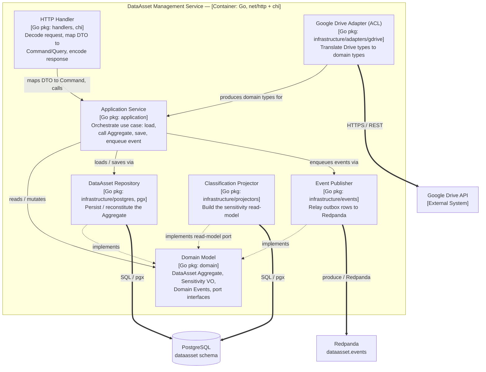

# Component Diagram — Artifact Template and Worked Example

Self-contained reference: the output artifact template for a C4 Level 3
Component diagram in this repo, plus a fully worked example for the **DataAsset
Management** service. Read together with `c4-component-notation.md` (notation
rules) and `layering-and-dependency-rules.md` (the constraints the arrows obey).

The plugin's artifacts are plain Markdown, reviewable by a PM without IDE
tooling. Diagrams use Mermaid (renders in most Markdown viewers) with a textual
C4 fallback for when Mermaid is unavailable.

---

## 1. The artifact template

```markdown
---
name: component-diagram
product: [product name]
service: [service / container name]
bounded-context: [Bounded Context name]
version: 1.0.0
phase: design
created: [date]
owner: enterprise-architect
---

# Component Diagram: [Service Name]

## Container Context
One line: what this container is and which Level 2 neighbours it talks to
(its PostgreSQL schema, its Redpanda topics, the services it calls).

## Diagram
[Mermaid flowchart — boundary subgraph, component nodes, inward-only arrows]

## Element Catalog

### Components
| Component | Package | Interface presented | Responsibility |
|---|---|---|---|

### Relationships
| From | To | Nature | Direction rationale |
|---|---|---|---|

## Dependency Rule Compliance
Statement that arrows point inward; where each port interface is declared.

## Fitness Function
The named automated check that enforces the layering (e.g. `go-makefile`'s
`arch` target running `scripts/check-imports.sh`), asserted as a deliverable.

## Variability
What changes per deployment — e.g. per-tenant physical isolation: identical
component structure, one instance per tenant against its own PostgreSQL schema.

## Rationale
One or two sentences for each NON-default structural choice. Omit if the
service is the plain four-layer default (in which case, per the skill body,
you probably should not be drawing this diagram at all).
```

Notation rules to obey while filling this in are in `c4-component-notation.md`;
the constraint rules the "Relationships" table must satisfy are in
`layering-and-dependency-rules.md`.

---

## 2. Worked example — DataAsset Management service

The DataAsset Management service owns the DataAsset Aggregate. It ingests asset
metadata discovered from connected sources (Google Drive, S3), classifies
sensitivity, and emits Domain Events consumed by the Compliance and Reporting
Bounded Contexts. It is drawn here *because* it is non-obvious: it has an
Anti-Corruption Layer for the Google Drive connector and a read-model projector
split from the write-path repository — two departures from the default skeleton
that a reviewer must understand before implementation.

### Container Context

`dataasset-management-service` — a Go (`net/http` + `chi`) container. It reads
and writes the `dataasset` PostgreSQL schema (its own database, per tenant),
publishes to the `dataasset.events` Redpanda topic, and calls the external
Google Drive API through an Anti-Corruption Layer. Sits below the
`dataasset-management` container box in the Container diagram.

### Diagram (Mermaid)



Dotted arrows labeled "implements" are the Dependency-Inversion crossings: the
infrastructure component points *inward* at a port declared in `domain/`. Solid
inward arrows are plain calls. Thick `===>` arrows leave the boundary box to
other containers and are the only arrows that carry a protocol label.

### Diagram (textual C4 fallback)

```
Boundary: DataAsset Management Service [Go, net/http + chi]

  HTTP Handler ─▶ Application Service        (maps DTO to Command, calls)
  Application Service ─▶ Domain Model         (reads / mutates Aggregate)
  Application Service ─▶ DataAsset Repository (loads / saves Aggregate)
  Application Service ─▶ Event Publisher      (enqueues Domain Events)
  DataAsset Repository ┄▶ Domain Model        (implements Repository port)
  Event Publisher ┄▶ Domain Model             (implements EventPublisher port)
  Classification Projector ┄▶ Domain Model    (implements read-model port)
  Google Drive Adapter ─▶ Application Service (supplies translated domain types)

Crossing the boundary (protocol-bearing):
  DataAsset Repository ══▶ PostgreSQL [dataasset schema]  (SQL / pgx)
  Classification Projector ══▶ PostgreSQL                 (SQL / pgx)
  Event Publisher ══▶ Redpanda [dataasset.events]         (produce)
  Google Drive Adapter ══▶ Google Drive API               (HTTPS / REST)
```

### Element Catalog — Components

| Component | Package | Interface presented | Responsibility |
|---|---|---|---|
| HTTP Handler | `handlers/` | chi routes on `/dataassets` | Decode/validate request, map DTO→Command/Query, call Application, encode response. No business logic. |
| Application Service | `application/` | `RegisterDataAsset`, `ReclassifyDataAsset`, `GetDataAsset` handlers | Orchestrate one use case: load Aggregate, call it, save, enqueue outbox event. Handles idempotency. |
| Domain Model | `domain/` | `DataAsset`, `Sensitivity`, `DataAssetRepository`, `EventPublisher` | Aggregates, Value Objects, Domain Events, port interfaces. Invariants live only here. Stdlib-only. |
| DataAsset Repository | `infrastructure/postgres/` | implements `domain.DataAssetRepository` | Persist/reconstitute the Aggregate via pgx. Humble Object; integration-tested. |
| Event Publisher | `infrastructure/events/` | implements `domain.EventPublisher` | Relay Transactional Outbox rows to the `dataasset.events` Redpanda topic. |
| Classification Projector | `infrastructure/projectors/` | implements `domain.ReadModelWriter` | Build the sensitivity read-model off the event stream, off the write path. |
| Google Drive Adapter (ACL) | `infrastructure/adapters/gdrive/` | `gdrive.Client` → domain types | Anti-Corruption Layer: translate Drive API types into domain types; isolate the external model. |

### Element Catalog — Relationships

| From | To | Nature | Direction rationale |
|---|---|---|---|
| HTTP Handler | Application Service | calls | Adapters (web) depend inward on use cases |
| Application Service | Domain Model | reads/mutates | Use cases depend inward on entities |
| Application Service | DataAsset Repository | uses (via port) | Depends on the `domain` interface, not the pgx type |
| DataAsset Repository | Domain Model | implements port | Inversion: outer detail conforms to inner abstraction |
| Event Publisher | Domain Model | implements port | Inversion: outbox relay conforms to `EventPublisher` |
| Classification Projector | Domain Model | implements port | Read-model writer conforms to a domain port |
| Google Drive Adapter | Application Service | supplies domain types | ACL keeps the external model out of the domain |

### Dependency Rule Compliance

All arrows point inward toward `domain/`. The `DataAssetRepository`,
`EventPublisher`, and `ReadModelWriter` interfaces are declared in
`domain/ports.go`; `infrastructure/` implements them. `domain/` imports the
standard library only.

### Fitness Function

`go-makefile`'s `arch` target runs `scripts/check-imports.sh`, failing the build
if anything under `internal/domain/` imports outside the standard library. This
keeps the inward-only invariant true after approval.

### Variability

Per-tenant physical isolation: the component structure above is identical for
every tenant. Each tenant runs its own `dataasset-management-service` instance
against its own PostgreSQL database/schema and its own Redpanda topic partition
set. The diagram is one template instantiated N times, once per tenant.

### Rationale

- **Classification Projector split from the Repository** — the sensitivity
  read-model is updated off the `dataasset.events` stream (CQRS read side), not
  on the write path, so it is a separate component with its own port rather than
  a method on the write-path repository. Keeps the write model uncoupled from
  read-model shape changes.
- **Google Drive Adapter as an explicit ACL** — the Drive API's model (files,
  permissions, revisions) is messy and external; isolating its translation in
  `infrastructure/adapters/gdrive/` keeps those types out of `domain/`, so a
  Drive API change never reaches an Aggregate. This departure from the plain
  four-layer skeleton is the main reason this service earns a component diagram.
