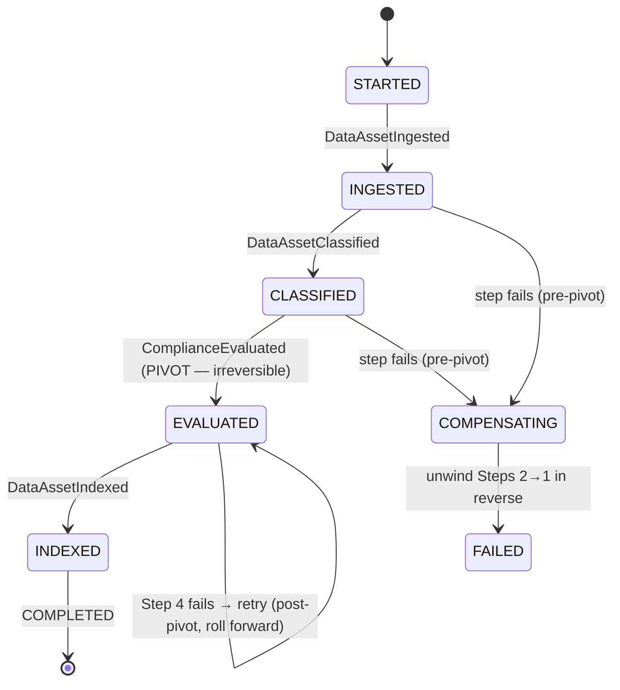

# The Saga Pattern in Depth

Full reference for designing Sagas in this platform. A **Saga** is a sequence of local transactions that together achieve a business outcome spanning multiple services or Aggregates, where a single ACID transaction is impossible. Each step commits locally and emits an event (or receives a Command) that advances the Saga; if a step fails, **compensating transactions** semantically undo the completed steps.

The Saga exists because **two-phase commit (2PC) does not scale to microservices** (Kleppmann, *Designing Data-Intensive Applications*, Ch. 9): 2PC is a *blocking* protocol — if the coordinator crashes after participants vote "yes" but before it broadcasts commit, participants hold locks indefinitely, unable to resolve safely. This platform therefore achieves atomicity *locally* (one transaction, one node — the Transactional Outbox) and stitches cross-service effects together as an idempotently-retriable event stream with explicit compensations. There is **no distributed transaction** anywhere in this platform.

Worked domain: DataAsset Management, Compliance, and Reporting Bounded Contexts; Go + pgx services; per-tenant physical isolation; Redpanda topics.

---

## Two Saga styles

### Choreographed Saga

Each participant knows its own compensating action and reacts to the prior step's event. No coordinator.

```
Step 1: ConnectStorageSource   → emits StorageSourceConnected
Step 2: CreateConsumerGroup    → emits ConsumerGroupCreated  (or Failed → compensate Step 1)
Step 3: TriggerInitialScan     → emits InitialScanStarted    (or Failed → compensate Steps 1–2)
```

If Step 2 fails, the Step-2 service emits a `ConsumerGroupCreationFailed` event that the Step-1 service reacts to by running its compensation (`DisconnectStorageSource`). This is Ford's **Anthology Saga** (async, eventual, choreographed) — most decoupled, but no central view of progress.

**Use when** the Saga is short (2–3 steps), steps are genuinely independent, and no single place needs to answer "where is this now?"

### Orchestrated Saga

A persistent orchestrator holds the Saga's state, issues Commands, and drives compensations. Ford's **Parallel Saga** (async, eventual, orchestrated) — the recommended default for complex flows.

```
Saga Orchestrator state machine:
  STARTED             → send ConnectStorageSource
  STORAGE_CONNECTED   → send CreateConsumerGroup
  GROUP_CREATED       → send TriggerInitialScan
  SCAN_TRIGGERED      → COMPLETED
  On failure at GROUP step: → send DisconnectStorageSource (compensate) → FAILED
```

**Use when** the Saga has 4+ steps, needs a queryable progress view, or has non-trivial compensation ordering.

### Choosing between the two

| Force | Pushes toward Choreographed | Pushes toward Orchestrated |
|---|---|---|
| Step count | 2–3 | 4+ |
| "Where is this now?" query needed | No | Yes |
| Compensation ordering | Simple / linear | Non-trivial, must be centrally driven |
| Team decoupling | Maximum decoupling wanted | Acceptable to couple to a coordinator |
| Debuggability | Distributed logs acceptable | Single-place trace required |
| Ford archetype | Anthology Saga | Parallel Saga |

The platform default: **choreographed** for a two-context reaction with a compensation each service owns; **orchestrated** for any business process that a PM (Shafi) must be able to see the progress of on a dashboard. "Can Shafi ask *where is this scan?* and get one answer" is the deciding heuristic — a queryable central state means orchestration.

---

## Saga state ownership (Ford)

Ford et al. are explicit that a Saga's **state must be owned somewhere durable and single**. In an orchestrated Saga, the orchestrator owns the state in its own database — it is the single owner of the Saga instance's progress. The orchestrator must **not** reach into participants' databases or apply their business rules (that makes it a god service and bypasses participants' invariants). Its only jobs are: send Commands, record state transitions, and trigger compensations.

The orchestrator persists each state transition **before** dispatching the next Command. A crash between "dispatched Command" and "persisted new state" is resolved by participant **idempotency**: on restart the orchestrator re-dispatches from its last persisted state, and the participant deduplicates the repeated Command.

**Saga state table (per-tenant PostgreSQL):**

```sql
CREATE TABLE saga_instances (
    id              UUID PRIMARY KEY,
    saga_type       TEXT        NOT NULL,       -- e.g. 'estate_scan'
    current_state   TEXT        NOT NULL,       -- e.g. 'STORAGE_CONNECTED'
    payload         JSONB       NOT NULL,       -- compensation data captured on the way forward
    started_at      TIMESTAMPTZ NOT NULL DEFAULT now(),
    updated_at      TIMESTAMPTZ NOT NULL DEFAULT now(),
    completed_at    TIMESTAMPTZ,
    failed_at       TIMESTAMPTZ,
    failure_reason  TEXT
);
```

---

## Compensating transactions — the five non-negotiable rules

Compensation is where Sagas fail in production. These rules are mandatory:

1. **Compensate in reverse order.** Step 3 fails → compensate Step 2, then Step 1. Forward steps build on earlier state; unwinding out of order compensates state a later compensation still depends on.
2. **Compensations must not fail permanently.** A compensating transaction is retried until it succeeds or is escalated (DLQ + alert). There is no "compensation of a compensation" — design each compensation to be idempotent and *always eventually applicable*.
3. **Compensation is semantic, not rollback.** `DisconnectStorageSource` does not make `StorageSourceConnected` un-happen — both facts remain in event history. Downstream consumers of the intermediate events must tolerate seeing work that was later compensated (a scan that started, then cancelled).
4. **Compensation data is captured on the way forward.** Each step records in the Saga `payload` whatever its compensation will need (created IDs, prior values). A compensation that must query *current* state to know what to undo will race concurrent changes.
5. **Every step is classified** — see the pivot concept below.

---

## The pivot transaction

Every Saga step is classified into exactly one of three kinds:

- **Compensatable** — a step that *can* be semantically undone (e.g., "create consumer group" → "delete consumer group").
- **Pivot** — the **point of no return**. Once the pivot transaction commits, the Saga can only move forward; it cannot be compensated. The pivot is the step that commits the irreversible business fact.
- **Retryable** — a step *after* the pivot that must always eventually succeed (it cannot be undone, so it is retried until it does).

**The ordering law:** all **compensatable** steps must precede the **pivot**, and all **retryable** steps must follow it. There is **exactly one pivot per Saga** — *a Saga with two pivots is really two Sagas* and must be split. This constraint is what makes recovery deterministic: before the pivot, failure unwinds backward; after the pivot, failure rolls forward.

Choosing the pivot is a design decision: it is the first step whose effect the business considers committed and externally visible. Everything reversible is arranged before it; everything that merely completes the now-committed outcome is arranged after.

---

## Worked example: the DataAsset ingestion Saga

A tenant connects a Google Drive source; the platform must ingest, classify, compliance-check, and index its DataAssets. This is a 4-step orchestrated Saga (`saga_type = 'dataasset_ingestion'`), owned by an **Ingestion Orchestrator** in the DataAsset Management context.

| # | Step (local transaction) | Emits | Class | Compensation |
|---|---|---|---|---|
| 1 | **Ingest** — crawl the source, persist raw `DataAsset` rows (status `INGESTED`) | `DataAssetIngested` | Compensatable | **Delete-ingested** — soft-delete the ingested rows (`deleted_at = now()`), release the crawl lock |
| 2 | **Classify** — run classification, write sensitivity labels | `DataAssetClassified` | Compensatable | **Unclassify** — remove the labels written in step 2 (IDs captured in `payload`) |
| 3 | **Compliance-check** — evaluate the classified assets against the tenant's compliance framework; **record the compliance verdict** (the irreversible, audit-relevant fact) | `ComplianceEvaluated` | **PIVOT** | *(none — pivot cannot be compensated)* |
| 4 | **Index** — project the assets + verdicts into the Reporting Read Model and the Apache AGE graph | `DataAssetIndexed` | Retryable | *(none — retried until it succeeds)* |

**Why step 3 is the pivot.** The compliance verdict is an audit fact with **non-repudiation** requirements — once recorded it cannot be quietly withdrawn. Everything reversible (ingest, classify) is arranged *before* it; indexing, which merely publishes the now-committed verdict into Read Models, is arranged *after* it and is retryable.

**Failure walkthroughs:**

- **Step 2 fails** (classification errors). Orchestrator state is `INGESTED`; it runs Step 1's compensation (soft-delete ingested rows), sets `failed_at`, and emits `IngestionFailed`. No compliance verdict was ever recorded — clean unwind.
- **Step 4 fails** (Read Model DB unavailable). The Saga is *past the pivot* — the compliance verdict is committed and must stand. The orchestrator does **not** compensate; it **retries** Step 4 with exponential backoff until the Read Model recovers. The system is temporarily in an eventual-consistency window: the verdict exists but the dashboard hasn't caught up. This is acceptable and visible.
- **Orchestrator crashes between Step 3 dispatch and state persistence.** On restart it re-dispatches the compliance-check Command; the Compliance service deduplicates it via its `processed_message_ids` table (the verdict is written once), and the Saga proceeds.

**Consumer tolerance.** Because compensation is semantic, a Reporting consumer that saw `DataAssetClassified` for an asset later compensated in a Step-2 failure must tolerate a subsequent `DataAssetUnclassified` (or the soft-delete). Read Models are designed to be corrected by later events, never assumed final at first sight.

**State machine of the ingestion Saga:**



Note the asymmetry: any failure **before** `EVALUATED` (the pivot) transitions to `COMPENSATING` and unwinds backward to `FAILED`; a failure at or **after** the pivot self-loops on retry and can only roll forward to `COMPLETED`. That asymmetry is the entire practical purpose of classifying steps and placing the pivot.

---

## Cross-Aggregate invariants and write skew (Kleppmann Ch. 7)

Because this platform enforces cross-Aggregate references *by ID only* (never a cross-Aggregate transaction), any invariant spanning two Aggregates is checked and enforced across **two separate transactions** — precisely the shape Kleppmann identifies as vulnerable to **write skew** (two concurrent transactions each read a consistent snapshot, each individually valid, jointly violating an invariant). A Saga that enforces such an invariant across steps cannot rely on a single-Aggregate `version`-column CAS (which only prevents *lost update*). Where a Saga must uphold a cross-Aggregate invariant (e.g., "a source may be attached to only one active scan"), name the mechanism explicitly: a uniqueness constraint on the single owning Aggregate, an application-level lock, or `SERIALIZABLE` isolation on the deciding step — not an assumption that per-step optimistic concurrency suffices.

---

## Saga design checklist

- [ ] Coordination style chosen (choreographed for ≤3 independent steps; orchestrated for 4+ or any with compensation ordering).
- [ ] Every step classified: compensatable, pivot, or retryable.
- [ ] Exactly **one** pivot; all compensatable steps precede it; all retryable steps follow it.
- [ ] Every compensatable step has an idempotent, always-applicable compensation.
- [ ] Compensation data captured in the Saga `payload` on the way forward.
- [ ] Saga state persisted before each Command dispatch; participants idempotent to absorb re-dispatch.
- [ ] Consumers of intermediate events tolerate later compensation.
- [ ] Cross-Aggregate invariants (if any) have a named write-skew defense.
