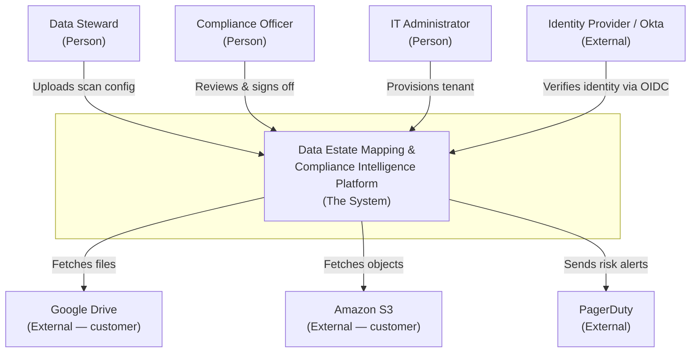

# System Context Diagram — Template and Worked Example

The artifact template for a System Context Diagram and a fully worked example
for this repo's product (the data-estate / compliance platform). Self-contained:
the frontmatter, the three notations (ASCII, textual C4, Mermaid), and every
supporting table are here.

---

## Artifact Template

```markdown
---
name: system-context-diagram
product: [product name]
version: 1.0.0
phase: design
created: [YYYY-MM-DD]
owner: enterprise-architect
---

# System Context Diagram: [Product Name]

## Diagram

[ASCII diagram — the primary presentation, PM-reviewable]

## Element Catalog

### System
**[System Name]:** [one-sentence purpose — what it does for its users]

### Persons
| Person | Role description | Interaction with system |
|---|---|---|

### External Systems
| System | Owner | Third-party or customer-owned | What it provides / receives |
|---|---|---|---|

### Relationships
| From | To | What flows | Protocol |
|---|---|---|---|

## Rationale
[One or two sentences on why this boundary and these external systems —
distinct from Boundary Notes. Explains the view's shape, not the constraints.]

## Boundary Notes
[Data-residency and tenant-isolation constraints that force what is inside vs.
outside the boundary — the constraints, not the shape reasoning.]
```

The **Element Catalog** and **Rationale** sections are not optional decoration —
per Clements, a Level 1 view without them is "just a picture," reviewable by eye
but not buildable as a specification the Container diagram derives from.

---

## Worked Example — Data-Estate & Compliance Platform

### Diagram (ASCII primary presentation)

```
                    ┌──────────────────────────────┐
                    │  (Person) Data Steward        │
                    │  Configures scans, curates    │
                    │  the data catalog             │
                    └───────────────┬──────────────┘
                                    │ Uploads scan config,
                                    │ reviews classified assets
                                    ▼
  ┌────────────────┐   ┌──────────────────────────────┐   ┌────────────────┐
  │ (External)     │   │                              │   │ (External)     │
  │ Google Drive   │◀──│   Data Estate Mapping &      │──▶│ Amazon S3      │
  │ Customer's     │   │   Compliance Intelligence     │   │ Customer's     │
  │ source files   │   │   Platform                    │   │ source files   │
  └────────────────┘   │                              │   └────────────────┘
                       │   Maps the data estate,       │
  ┌────────────────┐   │   classifies files, detects   │   ┌────────────────┐
  │ (Person)       │──▶│   compliance gaps, and        │◀──│ (External)     │
  │ IT             │   │   reports risk                │   │ Identity       │
  │ Administrator  │   │                              │   │ Provider (Okta)│
  │ Provisions the │   └───────┬──────────────┬──────┘   │ Verifies user  │
  │ tenant, links  │           │              │          │ identity (OIDC)│
  │ credentials    │           │              │          └────────────────┘
  └────────────────┘           │              │
                               │              │ Sends compliance
             Reviews reports,  │              │ risk alerts
             signs off         │              ▼
                               │      ┌────────────────┐
                               ▼      │ (External)     │
                   ┌──────────────────┴──┐  PagerDuty  │
                   │ (Person)            │  Receives    │
                   │ Compliance Officer  │  risk alerts │
                   │ Reviews gaps,       │──────────────┘
                   │ signs off reports   │
                   └─────────────────────┘
```

### Element Catalog

**System**

**Data Estate Mapping & Compliance Intelligence Platform:** Maps a customer's
data estate across their cloud storage, classifies discovered files, detects
compliance gaps, and reports risk to the customer's compliance and security
staff.

**Persons**

| Person | Role description | Interaction with system |
|---|---|---|
| Data Steward | Owns the data catalog for a tenant | Uploads scan configuration; reviews classified data assets |
| Compliance Officer | Accountable for regulatory posture | Reviews compliance gaps; signs off on reports |
| IT Administrator | Operates the tenant on the customer side | Provisions the tenant; connects storage credentials |
| CISO / Security Lead | Owns security policy and risk thresholds | Receives risk alerts; sets policy thresholds |

**External Systems**

| System | Owner | Kind | What it provides / receives |
|---|---|---|---|
| Google Drive | Customer | Customer-owned | Provides source files and metadata the platform scans |
| Amazon S3 | Customer | Customer-owned | Provides source files the platform scans |
| Identity Provider (Okta) | Customer / vendor | Third-party SaaS | Verifies user identity via OIDC/SAML |
| PagerDuty | Vendor | Third-party SaaS | Receives compliance risk alerts |

**Relationships**

| From | To | What flows | Protocol |
|---|---|---|---|
| Data Steward | Platform | Scan configuration, catalog review actions | HTTPS/JSON |
| Compliance Officer | Platform | Report review and sign-off | HTTPS/JSON |
| IT Administrator | Platform | Tenant provisioning, credential linkage | HTTPS/JSON |
| Platform | Google Drive | Fetches file metadata and content | Google Drive API |
| Platform | Amazon S3 | Fetches objects and metadata | S3 API |
| Identity Provider | Platform | Identity assertions | OIDC |
| Platform | PagerDuty | Compliance risk alerts | Events API (webhook) |

### Rationale

Google Drive and Amazon S3 are external because the customer owns their content
stores; the platform only reads from them and never becomes the system of record
for customer files. The Identity Provider is external because identity is
asserted by the customer's own or a vendor SSO, not minted by us. Everything the
team builds and operates — the DataAsset Management, Compliance, and Reporting
services, the per-tenant PostgreSQL, Redpanda, Apache AGE, and the React SPA —
collapses into the single system box and is deferred to the Container view.

### Boundary Notes

Per-tenant physical isolation (separate Kubernetes namespace, separate
PostgreSQL instance, separate Redpanda namespace per tenant) is a Level 2/3
deployment concern and is not shown here. The data-residency constraint (a
tenant's scanned content must stay in that tenant's region) is what fixes
Google Drive and S3 as read-only external sources rather than internal stores —
it forces the boundary drawn above but does not itself appear on the diagram.

---

## Textual C4 (structured, tool-renderable)

Some teams prefer a structured textual form that a tool can render. This maps
1:1 to the ASCII above:

```
System: Data Estate Mapping & Compliance Intelligence Platform
  description: Maps the data estate, classifies files, detects compliance gaps.

Person: Data Steward       -> System : Uploads scan config, reviews assets
Person: Compliance Officer -> System : Reviews gaps, signs off reports
Person: IT Administrator   -> System : Provisions tenant, links credentials
Person: CISO               <- System : Receives risk alerts

System -> External: Google Drive        : Fetches file metadata & content [Drive API]
System -> External: Amazon S3           : Fetches objects & metadata [S3 API]
External: Identity Provider -> System   : Verifies user identity [OIDC]
System -> External: PagerDuty           : Sends compliance risk alerts [webhook]
```

---

## Mermaid (optional, for rendered docs)

Mermaid's `flowchart` gives a rendered version for wikis that support it. Keep
the ASCII as the canonical PM-reviewable artifact; Mermaid is a convenience.



Mermaid class-based colouring (blue system, yellow persons, grey externals) can
be added with `classDef`, but the `(Person)` / `(External)` text tags carry the
semantics even without colour — matching the ASCII convention.

---

## Producing the Artifact — Ordered Steps

1. Read the product name and one-line purpose from `sdlc-context.json →
   first_product`.
2. Inventory personas (`user-persona`) → one person element each.
3. Inventory External System (pink) cards from Event Storming → candidate
   external systems.
4. Read the `nfr-specification` for data-residency constraints that move a
   system across the boundary.
5. Apply the "do we build and own it?" test to every candidate (see
   `boundary-identification.md`); collapse all internal containers into the
   single system box.
6. Draw the one system box; place person elements and external systems around
   it.
7. Draw and label each relationship (initiator → target, what flows, protocol).
8. Run the boundary anti-pattern checklist.
9. Write the Element Catalog, Rationale, and Boundary Notes.
10. Present to Shafi for approval before advancing to the Container diagram.
