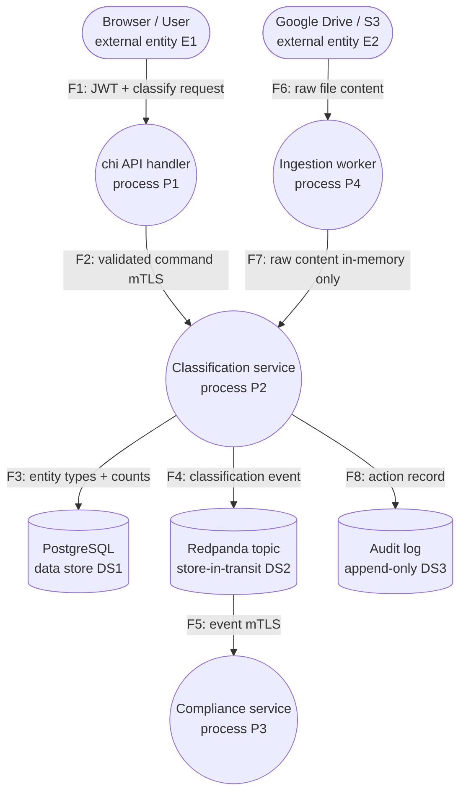

# Worked Threat Model — DataAsset ingestion → classification → compliance

A complete, end-to-end threat model for this repo's core flow, produced by running
the Four-Question Framework. It shows every deliverable in one place: the DFD
(Question 1), the STRIDE-per-element grid (Question 2), the per-cell mitigation or
accepted-risk note (Question 3), one attack tree for the crown-jewel goal, and the
validation checklist (Question 4). Use it as the shape a real threat model should
take, not as a substitute for modeling your own flow.

Stack grounding: Go + chi + pgx + Redpanda; per-tenant **physical** isolation;
Linkerd mTLS (transport identity only; ABAC is the authorization decision);
OpenTelemetry/Prometheus/Tempo/Grafana; raw file contents **never** persisted —
only entity types and counts.

---

## Question 1 — What are we building? (DFD + trust boundaries)



Trust boundaries (dashed lines in the drawn diagram; see
`references/dfd-and-trust-boundaries.md` for the full set):

- **TB1 — browser/API edge:** crossed by F1.
- **TB2 — external-ingestion edge:** crossed by F6.
- **TB3 — Linkerd mTLS hop:** crossed by F2 and F5.
- **TB4 — per-tenant namespace edge:** the physical-isolation boundary around
  DS1/P2 — the crown-jewel boundary.
- **TB5 — data store edge:** crossed by F3 (→DS1), F4 (→DS2), F8 (→DS3).

---

## Question 2 & 3 — STRIDE-per-element grid, with mitigations

Cells marked `—` are struck out as inapplicable per the element-type heuristics.
Every filled cell carries either a mitigation (M) or an accepted-risk note (AR).

### E1 — Browser/User (external entity → S, R apply)

| Letter | Threat | Mitigation / note |
|---|---|---|
| S | Attacker uses a stolen JWT to act as another user | **M:** RS256 JWT, validated on every request (sig/expiry/issuer), ~1h expiry, server-side revocation |
| R | User denies submitting a classification | **M:** append-only audit record F8 → DS3 with `sub`, action, timestamp, trace ID |

### E2 — Google Drive / S3 (external entity → S, R apply)

| Letter | Threat | Mitigation / note |
|---|---|---|
| S | A spoofed external source feeds forged content | **M:** OAuth/service-account credentials per connector, validated before ingestion |
| R | Source disputes which file version was ingested | **AR:** external provenance beyond our control; we record ingestion time + source ID in DS3 and accept the residual gap |

### F6 — raw file content flow (data flow → T, I, D apply)

| Letter | Threat | Mitigation / note |
|---|---|---|
| T | Content altered in transit from the SaaS source | **M:** TLS to the external API; checksum where the provider exposes one |
| I | Raw file content exposed in transit | **M:** TLS in transit; content held in memory only, never logged |
| D | A flood of large files exhausts the ingestion worker | **M:** Circuit Breaker on the external call; per-tenant ingestion rate limit; Redpanda backpressure downstream |

### P2 — Classification service (process → all six apply)

| Letter | Threat | Mitigation / note |
|---|---|---|
| S | A non-meshed pod impersonates the classification service | **M:** Linkerd mTLS peer identity on every inbound hop (TB3) |
| T | Event payload tampered so a `Restricted` asset is recorded `Public` | **M:** signed classification event; `pgx` parameterized write to DS1 |
| R | The service's classification decisions are non-attributable | **M:** OpenTelemetry span per decision, correlated to the audit record in DS3 |
| I | **Raw PII lands in a debug log** | **M:** the never-persist-raw rule — the process stores **only entity types and counts**; no constructor path accepts raw text into a persisted/logged type |
| D | Classification queue exhausted by request flood | **M:** Redpanda backpressure; per-user write rate limits at the gateway |
| E | A read-only subject triggers a classification write | **M:** ABAC `AccessPolicy.Evaluate` in the Application-layer command handler, fails closed |

### DS1 — PostgreSQL (data store → T, I, R apply)

| Letter | Threat | Mitigation / note |
|---|---|---|
| T | A row altered outside the application (e.g. SQL injection) | **M:** `pgx` parameterized queries only; least-privilege DB role |
| I | **Cross-tenant read returns another tenant's assets** | **M:** physical namespace isolation (TB4) **plus** ABAC tenant-scope filter — two independent layers |
| R | Audit-relevant writes to DS1 are non-attributable | **M:** paired append-only record in DS3 |

### DS2 — Redpanda topic / store-in-transit (data store → T, I, R apply)

| Letter | Threat | Mitigation / note |
|---|---|---|
| T | A consumer reads a tampered event | **M:** signed events; mTLS producer/consumer identity |
| I | Event payload readable by an unauthorized consumer | **M:** encryption in transit (mTLS); topic ACLs scoped per tenant |
| R | Event origin non-attributable | **M:** producer identity in the event envelope + OTel trace ID |

### DS3 — Audit log (data store, logs → T, I, R apply)

| Letter | Threat | Mitigation / note |
|---|---|---|
| T | Audit records altered to break non-repudiation | **M:** append-only store; write-once role; integrity check |
| I | Audit log leaks who-did-what to an unauthorized reader | **M:** ABAC-scoped read; encryption at rest |
| R | (the audit log *is* the R mitigation for other elements) | n/a — this store exists to provide non-repudiation |

### F2 / F5 — service↔service flows (data flow → T, I, D apply)

| Letter | Threat | Mitigation / note |
|---|---|---|
| T | In-cluster MITM alters the command/event | **M:** Linkerd automatic mTLS on the hop (TB3) |
| I | In-cluster eavesdropping | **M:** mTLS encryption in transit |
| D | Flow saturated | **M:** Redpanda backpressure (F5); handler timeouts + Circuit Breaker (F2) |

### P1 / P3 / P4 (processes → all six)

Analysed the same way as P2; the highest-value cells are P1's Spoofing (JWT
validation at TB1) and Elevation of privilege (ABAC), P4's Denial of service on the
ingestion path (Circuit Breaker at TB2), and P4→P2's Information disclosure on F7
(raw content held in memory only, never persisted — the never-persist rule again).
Fill each remaining cell or strike it out; no element is left unexamined.

---

## Attack Tree — crown-jewel goal only

Goal (root): **Exfiltrate one tenant's classified DataAssets across the physical
isolation boundary (TB4).** OR-decomposed — any path achieves the goal.

```
Goal: read Tenant B's classified DataAssets while acting as Tenant A
│
├── OR  Compromise identity (S)
│   ├── Steal a JWT via XSS on the frontend            [mitigated: CSP, httpOnly, short expiry]
│   ├── Forge a JWT (algorithm confusion / weak key)   [mitigated: RS256, key rotation, alg pinning]
│   └── Impersonate a service on the mesh              [mitigated: Linkerd mTLS peer identity]
│
├── OR  Defeat authorization (E / I)
│   ├── Missing ABAC tenant-scope check in a handler   [mitigated: Evaluate() in Application layer, tested]
│   ├── Over-broad DB role reads across schemas        [mitigated: least-privilege per-tenant DB role]
│   └── Event routing sends Tenant A events to B       [mitigated: per-tenant topic ACLs]
│
└── OR  Bypass physical isolation (infra)
    ├── Reach Tenant B's Kubernetes namespace          [mitigated: NetworkPolicy, RBAC, namespace isolation]
    ├── Compromise a shared control-plane component     [AR: shared plane risk; monitored, documented]
    └── Read Tenant B's backups                         [mitigated: per-tenant encrypted backups, KMS scoping]
```

The tree makes visible that TB4 is defended by **two independent layers**
(authorization + physical isolation), so no single missing check leaks data — which
is exactly why the Information-disclosure cell on DS1 lists both.

---

## Question 4 — Did we do a good job? (validation loop)

- [ ] **DFD matches the built system** — every process, store, external entity, and
      flow in the running architecture appears in the diagram; no ingestion connector
      or data store added since the last review is missing.
- [ ] **STRIDE applied to every element** — E1, E2, P1–P4, DS1–DS3, and every
      boundary-crossing flow each have their applicable letters either filled or
      struck out; no element left in the "we forgot to look" state.
- [ ] **Every filled cell has a mitigation or a signed accepted-risk note** — the two
      AR cells (E2/R external provenance; shared control-plane) are explicitly
      accepted with rationale and a review date, not silently dropped.
- [ ] **Mitigations are testable** — each M names a mechanism with a verifying test
      (ABAC unit test, mTLS integration test, a `pgx` parameterization check, an
      audit-record assertion), so the threat model is the acceptance criterion for
      `security-implementation`.
- [ ] **Re-open trigger recorded** — any change to the DFD (new connector, new store,
      moved boundary) re-runs this loop.

Passing all five is what separates this worked model from a diagram.
